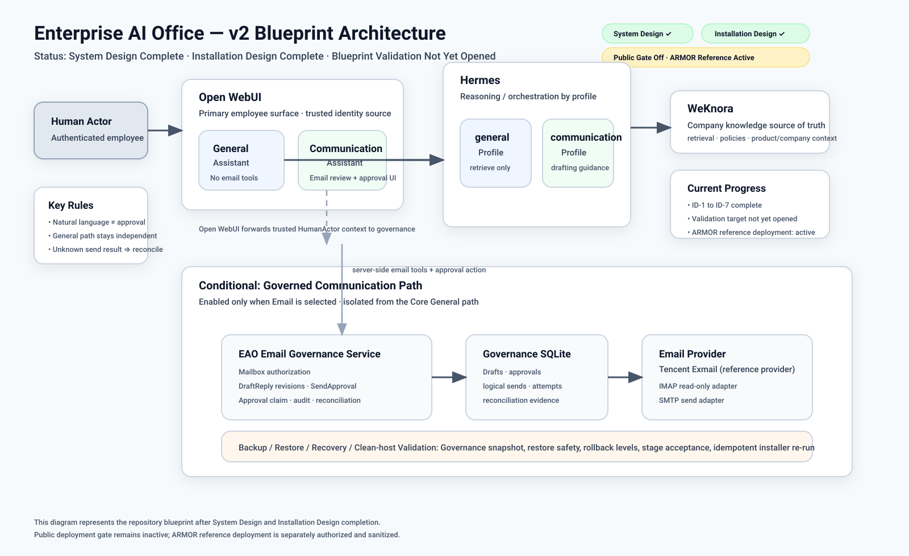

# Enterprise AI Office

> An agent-readable and agent-executable **system blueprint + installation blueprint** for building a governed, self-hosted enterprise AI workspace around **WeKnora + Hermes Agent + Open WebUI**, with capability-driven extensions for knowledge, specialized AI roles, coding agents, automation, messaging, enterprise identity, and governed business-system actions.

**[简体中文 README](./README.zh-CN.md)**

## Project status at a glance

| Milestone / capability | Status |
| --- | --- |
| v1 core employee path | ✅ Validated reference implementation |
| v2 System Design | ✅ Complete |
| v2 Installation Design | ✅ Complete |
| ID-1 Installation Architecture | ✅ Complete |
| ID-2 Config / Protected Inputs | ✅ Complete |
| ID-3 Stage / Capability Closure | ✅ Complete |
| ID-4 Identity / Authorization | ✅ Complete |
| ID-5 Governance Runtime | ✅ Complete |
| ID-6 Governed Send / Reconciliation | ✅ Complete |
| ID-7 Recovery / Clean-host Acceptance | ✅ Complete |
| Installation Design Final Review | ✅ PASS |
| Blueprint Validation | ⏳ Not yet opened |
| Release Ready | ⏳ Not yet opened |
| Real company deployment task | ⛔ Inactive |

> **Important:** “implemented” in this README means the repository already contains the corresponding system design, installation contract, reference adapters/scripts, schemas, or validated core assets. It does **not** mean the v2 email workflow has already been deployed to a real company mailbox.

Authoritative lifecycle state: [`state/PROJECT-PHASE.yaml`](state/PROJECT-PHASE.yaml).

## Architecture overview



The architecture deliberately keeps the validated v1 employee path independent from the new governed communication path:

```text
Employee
  ↓
Open WebUI
  ├─ General Assistant
  │    ↓
  │  Hermes `general`
  │    ↓
  │  WeKnora
  │
  └─ Communication Assistant
       ├─ Hermes `communication` Profile for reasoning
       └─ Open WebUI server-side governed Email actions/tools
            ↓
          eao-email-governance
            ├─ Governance SQLite
            └─ Email Provider
```

A failure in the v2 Email capability must not break:

```text
Open WebUI → General Assistant → Hermes general → WeKnora
```

## What this repository already implements

### 1. Validated core enterprise-AI employee path

The first validated core stack provides:

- **Open WebUI** as the employee-facing web client;
- **Hermes Agent** as the primary Agent runtime;
- **WeKnora** as the authoritative company-knowledge layer;
- grounded answers with source evidence;
- Open WebUI user/group/Assistant access controls;
- distinct Hermes Profile API boundaries;
- least-privilege employee tool exposure;
- conversation history and controlled file-upload behavior;
- backup / isolated restore reference procedures.

Core employee workflow:

```text
Employee
→ Open WebUI
→ General Assistant
→ Hermes `general` Profile
→ WeKnora
→ grounded company answer + source
```

### 2. Agent-readable deployment blueprint

The repository already includes:

- repository-local AI Agent operating contract in [`AGENTS.md`](AGENTS.md);
- deployment Golden Path in [`DEPLOY.md`](DEPLOY.md);
- machine-readable company capability registry in [`config/capabilities.yaml`](config/capabilities.yaml);
- public company configuration schema and private-overlay shape;
- protected-input / secret-reference rules;
- lifecycle gates separating blueprint work from real deployment;
- Core / Configured / Production readiness semantics;
- acceptance suites and provider-specific acceptance contracts;
- backup, restore, health-check, recovery, and state-recording helpers.

### 3. v2 governed Communication & Email system

The v2 blueprint now defines and provides reference implementation assets for the complete governed email loop:

```text
search email
→ read email
→ prepare DraftReply
→ exact human review
→ deterministic SendApproval
→ governed send
→ provider result
→ reconciliation when ambiguous
→ optional internal follow-up
```

Implemented repository capabilities include:

- `Mailbox`, `EmailMessage`, `DraftReply`, `SendApproval` domain model;
- trusted **HumanActor** identity boundary;
- mailbox-scoped `email.read / email.draft / email.approve / email.send` authorization;
- Open WebUI trusted server-side identity forwarding;
- deterministic approval Action using exact persisted draft content;
- immutable DraftReply revision + content-hash binding;
- single logical-send claim per approval;
- append-oriented governance evidence;
- protected reconciliation control path;
- failure-safe `SENT / CONFIRMED_NOT_SENT / OUTCOME_UNKNOWN` semantics.

### 4. Thin EAO Email Governance runtime design

v2 introduces only one new EAO-owned runtime responsibility:

```text
eao-email-governance
```

Reference persistence:

```text
SQLite
<runtime_root>/runtime/email-governance/state.sqlite3
```

The repository already contains reference assets for:

- immutable DraftReply revisions;
- review bindings;
- SendApproval evidence;
- ApprovalClaim / one-logical-send enforcement;
- logical send records;
- provider attempt records;
- normalized provider results;
- reconciliation evidence;
- governance audit events;
- schema migration and recovery contracts.

It intentionally does **not** add a CRM, workflow engine, Redis, PostgreSQL cluster, event bus, or mailbox mirror merely for architectural elegance.

### 5. Tencent Enterprise Mail reference provider

Tencent Exmail is the first reference Email provider for v2.

Repository assets include:

- read-only IMAP adapter candidate;
- non-mutating read safety tests;
- narrow SMTP send adapter;
- fake-SMTP deterministic tests;
- provider environment templates;
- provider-specific acceptance plan;
- ambiguous-send / duplicate-send safety contract.

The baseline send contract prevents generic “send anything” access and requires all intended recipients to be accepted before SMTP DATA is submitted.

### 6. Recovery and rollback

The repository now defines:

- Governance SQLite consistent backup;
- isolated Governance restore;
- schema-version fail-closed behavior;
- unresolved-send recovery without automatic retry;
- full-stack backup integration when v2 Email is enabled;
- v1-compatible backup behavior when v2 Email is disabled;
- capability rollback levels;
- clean-host installation sequence;
- installer second-run convergence rules;
- failure-injection acceptance expectations;
- v1 preservation after v2 rollback/failure.

## Current v2 installation-design result

The completed Installation Design work packages are:

| ID | Work package | Result |
| --- | --- | --- |
| ID-1 | Installation architecture + v1 preservation | ✅ Complete |
| ID-2 | Company config + protected-input contract | ✅ Complete |
| ID-3 | Stage sequencing + capability closure | ✅ Complete |
| ID-4 | Trusted identity + mailbox authorization propagation | ✅ Complete |
| ID-5 | Draft / approval governance runtime | ✅ Complete |
| ID-6 | Governed send + reconciliation | ✅ Complete |
| ID-7 | Rollback / recovery / clean-host acceptance | ✅ Complete |

Final review: [`docs/V2-INSTALLATION-DESIGN-REVIEW.md`](docs/V2-INSTALLATION-DESIGN-REVIEW.md).

Current repository state is intentionally:

```text
current_phase: installation_design
installation_design.status: complete
installation_design.transition_ready: true
blueprint_validation.status: not_opened
real_deployment_task.active: false
```

Completion does **not** automatically change lifecycle phase or authorize a real deployment.

## What is planned next

### Next blueprint milestone — Blueprint Validation

The next major repository task is to prove that a **fresh capable AI engineering agent** can consume this repository without hidden chat context and reproduce the intended system on an explicitly approved clean validation target.

Blueprint Validation should verify:

- clean-host preflight and target-state resolution;
- deterministic v1 installation / preservation;
- v2 capability installation sequence;
- protected-input handling;
- identity / authorization propagation;
- governance runtime initialization and migration;
- provider adapters with synthetic or controlled inputs;
- stage-by-stage acceptance;
- backup / restore;
- restart / failure recovery;
- installer re-run convergence;
- v2 rollback with v1 preservation;
- evidence recording sufficient for a new agent to continue safely.

### Later repository milestone — Release Ready

After Blueprint Validation findings are resolved:

- consolidate validation evidence;
- fix genuine reproducibility gaps;
- harden only where validation proves necessary;
- declare `RELEASE READY` when the repository adequately explains both system intent and installation execution.

### Future capabilities outside the current baseline

Potential later extensions, only when justified by real usage:

- Stage 5 simple communication follow-up through Hermes Cron;
- Stage 6 employee messaging surface;
- additional Email providers;
- governed attachments;
- governed Bcc support;
- richer operator reconciliation tooling;
- broader enterprise-system integrations;
- additional identity-provider-specific playbooks;
- other capabilities already represented by the generic capability framework.

Explicitly **not** a current goal: turning this project into a CRM, ERP, generic workflow platform, another RAG engine, another Agent framework, or a collection of every possible AI tool.

## Lifecycle vs deployment readiness

There are two different progress systems.

### Blueprint maturity

```text
SYSTEM DESIGN COMPLETE          ✅
INSTALLATION DESIGN COMPLETE    ✅
BLUEPRINT VALIDATED             ⏳
RELEASE READY                   ⏳
```

These describe the repository itself.

### Deployment-target readiness

```text
CORE READY
= baseline employee workflow works

CONFIGURED READY
= Core Ready
  + every company-enabled capability is deployed and accepted

PRODUCTION READY
= Configured Ready
  + applicable recovery/security/access/operations controls pass
```

These describe an explicitly approved validation or real deployment target.

## Source-of-truth map

| Information | Authority |
| --- | --- |
| Blueprint lifecycle / real deployment gate | `state/PROJECT-PHASE.yaml` |
| System & installation blueprint | normative repository contracts |
| Company knowledge | WeKnora |
| Agent role / behavior / tools | Hermes Profiles / SOUL / Skills / tools |
| Employee Web identity/access | Open WebUI / selected enterprise identity layer |
| Mailbox and provider delivery facts | Email Provider |
| Draft / approval / governed-send evidence | EAO Governance layer |
| Durable Agent tasks | Hermes Kanban when enabled |
| Scheduled work | Hermes Cron when enabled |
| Desired deployment | company-private active configuration |
| Actual deployment | runtime + deployment state |

## Core design rules

### Human identity is not an Agent Profile

```text
HumanActor
≠ Hermes Profile
≠ provider/mailbox credential
```

A Hermes Profile is an AI role/capability boundary, not an employee account.

### Knowledge is not memory

```text
WeKnora
= authoritative shared company knowledge

Hermes memory
= optional continuity state subject to isolation rules
```

### Natural language is not formal approval

A free-form message such as “send it” may express intent, but formal SendApproval must come through the deterministic trusted-human action path.

### Ambiguous external side effects fail safe

```text
SENT
→ never retry

CONFIRMED_NOT_SENT
→ controlled retry may be allowed inside the same logical send

OUTCOME_UNKNOWN
→ RECONCILIATION_REQUIRED
→ no blind retry
```

### Upstream first

```text
official upstream capability
→ official integration
→ configuration
→ thin adapter/playbook
→ custom infrastructure only when necessary
```

## First validated core stack

The first validated reference used:

```text
Host: Apple Silicon macOS
Container runtime: OrbStack / Docker
WeKnora: v0.8.0
Hermes Agent: v0.21.0, host-native
Open WebUI: v0.11.3
Employee Hermes long-term memory: disabled
```

Machine-readable baseline: [`config/validated-stack.yaml`](config/validated-stack.yaml).

Reference-instance evidence: [`state/DEPLOYMENT-STATE.md`](state/DEPLOYMENT-STATE.md).

A fresh deployment should use [`state/DEPLOYMENT-STATE.template.md`](state/DEPLOYMENT-STATE.template.md) rather than copy another environment's roles or capability state.

## Install with an AI agent

For blueprint validation or an explicitly authorized deployment, read in this order:

1. [`AGENTS.md`](AGENTS.md)
2. [`state/PROJECT-PHASE.yaml`](state/PROJECT-PHASE.yaml)
3. [`DEPLOY.md`](DEPLOY.md)
4. [`docs/COMPLETENESS.md`](docs/COMPLETENESS.md)
5. active company configuration based on [`config/company.example.yaml`](config/company.example.yaml)
6. [`config/capabilities.yaml`](config/capabilities.yaml)
7. [`config/validated-stack.yaml`](config/validated-stack.yaml)
8. referenced infrastructure playbooks / adapters
9. [`docs/ACCEPTANCE-TESTS.md`](docs/ACCEPTANCE-TESTS.md)

For v2 Email specifically, continue with:

1. [`docs/V2-SCOPE.md`](docs/V2-SCOPE.md)
2. [`docs/V2-EMAIL-DESIGN.md`](docs/V2-EMAIL-DESIGN.md)
3. [`docs/V2-INSTALLATION-ARCHITECTURE.md`](docs/V2-INSTALLATION-ARCHITECTURE.md)
4. [`docs/V2-CONFIG-PROTECTED-INPUTS.md`](docs/V2-CONFIG-PROTECTED-INPUTS.md)
5. [`docs/V2-STAGE-CONTRACTS.md`](docs/V2-STAGE-CONTRACTS.md)
6. [`docs/V2-IDENTITY-AUTHORIZATION-INSTALLATION.md`](docs/V2-IDENTITY-AUTHORIZATION-INSTALLATION.md)
7. [`docs/V2-GOVERNANCE-RUNTIME.md`](docs/V2-GOVERNANCE-RUNTIME.md)
8. [`docs/V2-SEND-RECONCILIATION.md`](docs/V2-SEND-RECONCILIATION.md)
9. [`docs/V2-RECOVERY-CLEAN-HOST.md`](docs/V2-RECOVERY-CLEAN-HOST.md)
10. [`docs/V2-INSTALLATION-DESIGN-REVIEW.md`](docs/V2-INSTALLATION-DESIGN-REVIEW.md)

## Capability-driven extension

Optional capabilities are installed only when selected by company configuration.

| Capability | Reference path |
| --- | --- |
| Specialist Profiles | `docs/PROFILE-STANDARD.md` + Hermes specialist templates |
| Hermes admin Web UI | `infrastructure/hermes-webui/` |
| Codex / Claude Code delegation | `infrastructure/coding-agents/` |
| Kanban | `infrastructure/hermes/features/` |
| Cron | `infrastructure/hermes/features/` |
| Enterprise messaging | `infrastructure/hermes/features/` |
| Tencent Enterprise Mail | `infrastructure/email/tencent-exmail/` |
| Remote/private access | `infrastructure/access/` |
| SSO / enterprise identity | `infrastructure/access/` |
| Employee long-term memory | Profile/RBAC isolation gate |

An enabled capability may not be silently skipped to manufacture a green result. A disabled capability should not be instantiated merely because a template exists.

## Repository self-check

Without installing anything:

```sh
sh scripts/repository-readiness-check.sh
```

Relevant offline v2 contract checks include:

```sh
python3 infrastructure/email/governance/test_schema.py
python3 infrastructure/email/governance/test_send_reconciliation.py
python3 infrastructure/email/governance/test_recovery.py
python3 infrastructure/email/tencent-exmail/test_imap_readonly.py
python3 infrastructure/email/tencent-exmail/test_smtp_send_adapter.py
```

Static/offline PASS is blueprint evidence only. It does not replace acceptance on an explicitly approved validation/deployment target.

## Documentation map

| Document | Purpose |
| --- | --- |
| [`AGENTS.md`](AGENTS.md) | AI agent operating contract |
| [`state/PROJECT-PHASE.yaml`](state/PROJECT-PHASE.yaml) | blueprint lifecycle + real deployment gate |
| [`DEPLOY.md`](DEPLOY.md) | installation/deployment Golden Path |
| [`docs/COMPLETENESS.md`](docs/COMPLETENESS.md) | readiness semantics |
| [`docs/V2-PHASE-STATUS.md`](docs/V2-PHASE-STATUS.md) | current v2 blueprint status |
| [`docs/V2-SCOPE.md`](docs/V2-SCOPE.md) | v2 Communication & Follow-up scope |
| [`docs/V2-EMAIL-DESIGN.md`](docs/V2-EMAIL-DESIGN.md) | governed email system design |
| [`docs/V2-DESIGN-REVIEW.md`](docs/V2-DESIGN-REVIEW.md) | System Design final review |
| [`docs/V2-INSTALLATION-ARCHITECTURE.md`](docs/V2-INSTALLATION-ARCHITECTURE.md) | ID-1 architecture / v1 preservation |
| [`docs/V2-CONFIG-PROTECTED-INPUTS.md`](docs/V2-CONFIG-PROTECTED-INPUTS.md) | ID-2 config + secret-input contract |
| [`docs/V2-STAGE-CONTRACTS.md`](docs/V2-STAGE-CONTRACTS.md) | ID-3 stage closure contracts |
| [`docs/V2-IDENTITY-AUTHORIZATION-INSTALLATION.md`](docs/V2-IDENTITY-AUTHORIZATION-INSTALLATION.md) | ID-4 trusted identity / authorization propagation |
| [`docs/V2-GOVERNANCE-RUNTIME.md`](docs/V2-GOVERNANCE-RUNTIME.md) | ID-5 governance runtime |
| [`docs/V2-SEND-RECONCILIATION.md`](docs/V2-SEND-RECONCILIATION.md) | ID-6 governed send / reconciliation |
| [`docs/V2-RECOVERY-CLEAN-HOST.md`](docs/V2-RECOVERY-CLEAN-HOST.md) | ID-7 recovery / clean-host contract |
| [`docs/V2-INSTALLATION-DESIGN-REVIEW.md`](docs/V2-INSTALLATION-DESIGN-REVIEW.md) | Installation Design final review |
| [`docs/ONTOLOGY.md`](docs/ONTOLOGY.md) | governed operational object/action contract |
| [`docs/ACCEPTANCE-TESTS.md`](docs/ACCEPTANCE-TESTS.md) | deployment readiness evidence suite |
| [`docs/acceptance/TENCENT-EXMAIL.md`](docs/acceptance/TENCENT-EXMAIL.md) | Tencent Exmail acceptance contract |
| [`docs/BACKUP-RESTORE.md`](docs/BACKUP-RESTORE.md) | backup / restore standard |
| [`docs/OPERATIONS.md`](docs/OPERATIONS.md) | operations / troubleshooting |
| [`docs/SECURITY.md`](docs/SECURITY.md) | trust / secrets / least privilege |
| [`state/DEPLOYMENT-STATE.template.md`](state/DEPLOYMENT-STATE.template.md) | clean deployment state template |

## What this project is not

Enterprise AI Office is not intended to become:

- a new RAG engine;
- a new general Agent framework;
- a WeKnora / Hermes / Open WebUI fork;
- a CRM or ERP;
- a generic workflow engine;
- a replacement for Codex or Claude Code;
- a “install every feature” component collection.

Its value is the **system design + installation design**, capability-driven desired state, governance boundaries, thin upstream adapters, recovery rules, acceptance evidence, and operating discipline around mature projects.

## ARMOR reference

ARMOR is the first reference implementation, while the project itself remains generic.

ARMOR-specific design and lessons belong under [`reference/armor/`](reference/armor/) and must not override another adopter's private configuration.

## License

Licensed under the **Apache License 2.0**. See [`LICENSE`](LICENSE).

Independent upstream software retains its own licenses and terms. See [`THIRD_PARTY_NOTICES.md`](THIRD_PARTY_NOTICES.md).
