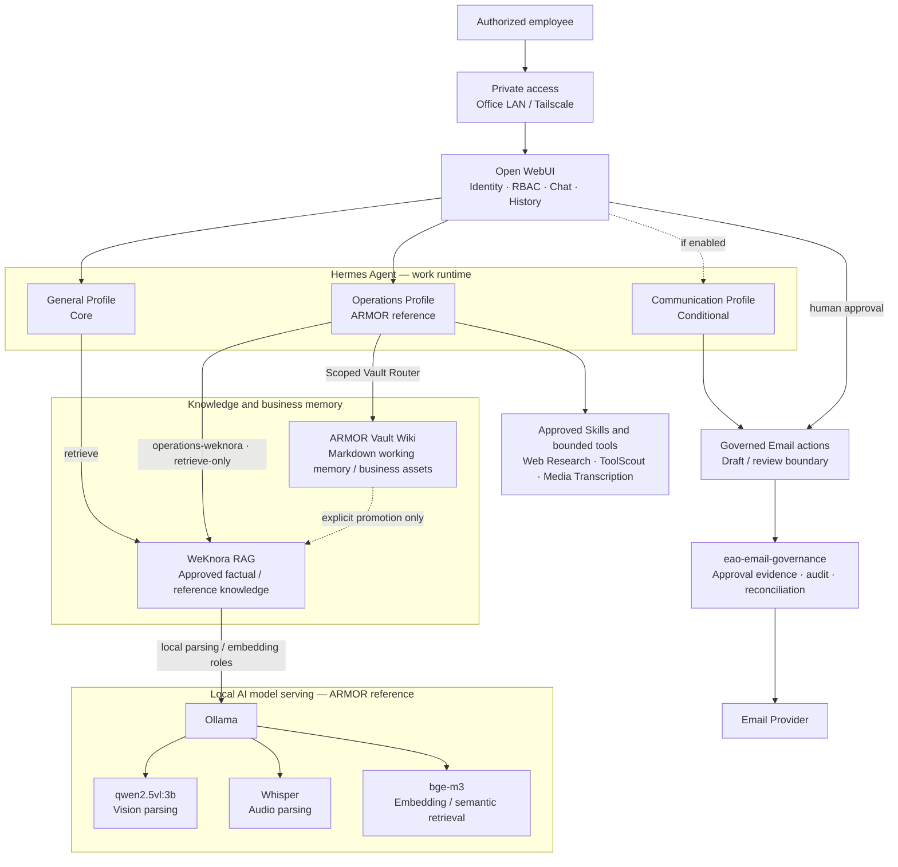

# Enterprise AI Office

> **EAO baseline: COMPLETE / deployed / handoff-ready / in use.** Enterprise AI Office is ARMOR's self-hosted AI workspace built around **WeKnora RAG + ARMOR Vault Wiki + Hermes Agent + Open WebUI**. The reference system has been installed on the designated company Mac Studio, operational acceptance has passed, employee access has been prepared, and the system is ready for departmental handoff. This repository now serves two roles at once: the maintained source of truth for the deployed reference system, and an agent-readable / agent-executable blueprint that another capable AI Agent can use to reconstruct the same architecture from explicit private deployment inputs.

**[简体中文 README](./README.zh-CN.md)**

## AI Agent start here

If you are a fresh AI engineering agent, do not infer the system from directory names or old chat context. Start with:

1. [`AGENTS.md`](AGENTS.md) — repository operating contract.
2. [`REPRODUCE.md`](REPRODUCE.md) — end-to-end fresh-agent reconstruction contract.
3. [`config/eao-manifest.yaml`](config/eao-manifest.yaml) — machine-readable system map.
4. [`VALIDATE.md`](VALIDATE.md) — Fresh-Agent validation contract.
5. [`DEPLOY.md`](DEPLOY.md) — deployment Golden Path.
6. [`state/REAL-DEPLOYMENT-STATUS.md`](state/REAL-DEPLOYMENT-STATUS.md) — sanitized current ARMOR reference-deployment status.

Before proposing any new component, run the mandatory [Capability Reuse Pass](docs/CAPABILITY-REUSE-PASS.md). For the documentation hierarchy, use the [Documentation authority map](docs/README.md). Maintainers and AI engineering agents should also follow [Repository governance](docs/REPOSITORY-GOVERNANCE.md).

## Project status at a glance

**Current project posture:** Core platform construction and the ARMOR reference installation are complete. The deployed system has passed the current acceptance baseline, is ready for departmental handoff, and can be used by employees through approved private access paths. Department account/access details can now be distributed operationally without further platform construction. Ongoing work is feedback-driven maintenance plus explicitly selected business capabilities. The next planned business capability is governed AI email marketing.

| Milestone / capability | Status |
| --- | --- |
| ARMOR reference EAO baseline | ✅ Deployed / in use / CONFIGURED READY — PASS |
| v1 core employee path | ✅ Validated reference implementation |
| v2 System Design | ✅ Complete |
| v2 Installation Design | ✅ Complete |
| ID-1 Installation Architecture | ✅ Complete |
| ID-2 Config / Protected Inputs | ✅ Complete |
| ID-3 Stage / Capability Closure | ✅ Complete |
| ID-4 Identity / Authorization | ✅ Complete |
| ID-5 Governance Runtime | ✅ Complete |
| ID-6 Governed Send / Reconciliation | ✅ Complete |
| ID-7 Recovery / Clean-host Acceptance | ✅ Complete |
| Installation Design Final Review | ✅ PASS |
| Enterprise Operations Capability Baseline v1.0 | ✅ Frozen |
| Hermes Skills Migration v1.0 | ✅ Closed |
| Enterprise Web Research v1.0 | ✅ Closed / Frozen / PASS |
| Operations employee RBAC v1 | ✅ Closed / Frozen / PASS |
| Media Transcription optional capability | ✅ Validated / enabled in ARMOR reference; not Core default |
| Operational EAO baseline | ✅ Complete / deployed / in use |
| Dual knowledge architecture (RAG + Wiki) | ✅ Active — WeKnora RAG + ARMOR Vault Wiki / working memory |
| Enterprise Self-Evolution v1 | 🧭 Design baseline defined — work-embedded employee experience learning; runtime not enabled pending Hermes capability audit |
| Local AI model infrastructure | ✅ Active in ARMOR reference — Ollama serves task-specific vision, audio, and embedding models for WeKnora; Hermes reasoning remains separate |
| Department handoff readiness | ✅ Ready — employee accounts and private access details can be distributed |
| Office-network employee access | ✅ Validated through the approved private network boundary |
| Remote employee access | ✅ Validated through Tailscale private access; no public exposure required |
| Repository maintenance model | ✅ Single long-lived branch: `main` |
| Backup / Restore | ➖ Optional capability / currently disabled |
| Next business capability | ▶ Governed AI Email Marketing |
| Blueprint Validation | ✅ Opened; validation PASS remains evidence-driven |
| Release Ready | ✅ Opened; phase-open status does not itself declare RELEASE READY |
| ARMOR real deployment | ✅ Active / deployed / in use; runtime details remain private and only sanitized status is published |

> **Operational status:** the ARMOR reference EAO baseline is installed on the designated company Mac Studio, has passed the current acceptance baseline, and is ready for departmental handoff. Employee accounts and the approved private access address can be distributed to department staff for normal use. Employees can authenticate to Open WebUI and use the approved General/Operations AI paths. Access has been validated both on the approved office/private network path and remotely through Tailscale, allowing authorized employees to reach EAO from outside the office without exposing the employee surface publicly. The Mac Studio internal disk is the current EAO runtime and primary data storage. The canonical ARMOR Vault also lives on the Mac Studio internal SSD and is exposed to authorized humans only through the approved private SMB boundary; the former NAS copy is not a runtime write target. Backup/restore is an optional capability and is not currently enabled; it may be adopted later if business need and storage conditions justify it.
>
> The public blueprint lifecycle is repository-governance state, not a proxy for whether the separately authorized ARMOR deployment exists or is usable. With the baseline system deployed and `CONFIGURED READY — PASS`, ongoing EAO work should primarily be feedback-driven maintenance and bounded capability extensions rather than continued core-platform construction.
>
> **Important:** “implemented” in this README means the repository contains the corresponding system design, installation contract, reference adapters/scripts, schemas, or validated core assets. It does **not** mean the v2 email workflow has already been deployed to a real company mailbox. Governed AI email marketing remains a separate follow-on business capability.

Authoritative lifecycle state: [`state/PROJECT-PHASE.yaml`](state/PROJECT-PHASE.yaml).

## Administrator resource intake

If an administrator discovers useful **knowledge, a Tool/MCP/service, or a third-party Skill**, start with [Administrator Resource Intake](docs/ADMIN-RESOURCE-INTAKE.md).

It is the routing entry point into the existing authorities rather than a new administrator runtime:

- durable knowledge → [Knowledge Intake v1](docs/KNOWLEDGE-INTAKE.md) → native WeKnora ingestion and retrieval verification;
- Tool / MCP / service / component → [Capability Reuse Pass](docs/CAPABILITY-REUSE-PASS.md) → reuse first, governed change only when a real gap remains;
- third-party Skill → [Capability Reuse Pass](docs/CAPABILITY-REUSE-PASS.md) → [Third-Party Skill Admission Standard](docs/SKILL-ADMISSION.md) → DIRECT / ADAPT / DELEGATE / REJECT.

The common rule is **review first, mutate later**. Installation does not automatically imply exposure or authorization.

## Enterprise Self-Evolution design baseline

EAO now defines a normative [Enterprise Self-Evolution v1](docs/SELF-EVOLUTION.md) design for turning experience that naturally appears during employee work into reusable organizational intelligence.

The central product constraint is: **humans must not end up serving the AI system**. Ordinary employees should not be asked to complete knowledge forms, classify lessons, maintain an AI knowledge base, or process a routine review queue. The preferred loop is work-embedded:

```text
normal employee work
→ Hermes detects a reusable correction / lesson / exception
→ source-aware role experience
→ scoped reuse in later work
→ real-world correction / reinforcement
→ refinement
```

The design reuses the existing Open WebUI, Hermes, ARMOR Vault, WeKnora, Skills, Profile, and repository-governance authorities. It introduces **no new database, vector store, workflow engine, or universal knowledge-review role**.

Current boundary: the architecture is defined, but the Self-Evolution runtime is **not enabled**. Employee Hermes long-term memory remains OFF, autonomous production Skill mutation is not authorized, and ordinary Vault content is not automatically promoted to WeKnora. The next required step is a Phase 0 audit of the actual deployed Hermes runtime before any native self-improvement capability is enabled.

## Repository maintenance model

EAO is maintained as a **solo-maintainer, single-main repository**.

```text
main
  ↓
short-lived task branch
  ↓
Pull Request
  ↓
Repository Readiness PASS
  ↓
merge
  ↓
head branch automatically deleted
```

Rules:

- `main` is the only long-lived branch;
- do not keep permanent `develop`, `release/*`, `docs/*`, `fix/*`, `codex/*`, `ci/*`, or `test/*` branches;
- GitHub's **Automatically delete head branches** setting is enabled;
- merged PRs and Git history preserve development history, so historical branches are not retained;
- use a short-lived branch for material changes, then delete it immediately after merge;
- keep the repository focused on the current deployable/maintainable EAO state rather than accumulating abandoned parallel implementations.

See [Repository governance](docs/REPOSITORY-GOVERNANCE.md) for the full contract.

## Architecture overview

The current Enterprise AI Office architecture is centered on four stable boundaries: a private employee access surface, Hermes Profile-based work execution, a dual knowledge layer, and capability-specific governed integrations. ARMOR-specific capabilities are layered on top of the reusable Core rather than redefining it.

The Communication/Email lane is a **conditional capability**, not part of mandatory Core, and is instantiated only when the active company configuration enables it.



The diagram above is the **current system view**, not a statement that every depicted lane is mandatory for every deployment.

| Layer / lane | Current status | Architectural meaning |
| --- | --- | --- |
| **Open WebUI** | Core / deployed | Employee identity, RBAC, chat UX, history, and approved Assistant access |
| **Hermes General** | Core / validated | Default employee work runtime and reasoning path |
| **Hermes Operations** | ARMOR reference / deployed / frozen | Shared least-privilege department Profile with approved Skills, bounded tools, WeKnora retrieval, and scoped Vault access |
| **WeKnora RAG** | Core knowledge layer / active | Approved enterprise factual/reference ingestion, retrieval, grounding, and source evidence |
| **ARMOR Vault Wiki** | ARMOR knowledge layer / active | Durable Markdown working memory, work products, research, publication records, workflow standards, and business assets |
| **Ollama local AI serving** | ARMOR reference / active | Task-specific WeKnora vision, audio, and embedding models; **not** the Hermes reasoning model |
| **Communication / Governed Email** | Conditional capability assets | Activated only when explicitly configured; external send remains behind human approval and governance |
| **Repository + protected company configuration** | Control / desired-state layer | Defines the reusable blueprint, enabled capabilities, deployment contracts, and private runtime inputs |

Key invariants:

- the reusable Core remains `Open WebUI → Hermes general → WeKnora`;
- upstream Open WebUI utilities such as `Arena Model` are evaluation features, not EAO work roles, Hermes Profiles, or intelligent task routers; normal employee work stays on explicitly provisioned Assistant → Hermes Profile paths (see [Open WebUI deployment adapter](infrastructure/open-webui/README.md));
- WeKnora and ARMOR Vault are complementary authorities by object/source type, not duplicate knowledge stores;
- ordinary Vault work products do **not** automatically flow into WeKnora; promotion requires an explicit knowledge-governance decision;
- Ollama provides task-specific local inference for WeKnora in the ARMOR reference deployment and does **not** imply that Hermes reasoning runs on a local LLM;
- Operations receives only approved Skills/tools and scoped knowledge interfaces; generic shell, browser, filesystem, code execution, and generic SMTP are not employee capabilities;
- conditional capabilities such as governed Email must fail independently without breaking the Core employee knowledge path.

For the reusable architecture contract, see [`docs/ARCHITECTURE.md`](docs/ARCHITECTURE.md). For the current sanitized ARMOR runtime, see [`state/REAL-DEPLOYMENT-STATUS.md`](state/REAL-DEPLOYMENT-STATUS.md). Capability enablement remains configuration-driven through [`config/capabilities.yaml`](config/capabilities.yaml).

### Dual knowledge architecture — RAG + Wiki

The ARMOR reference deployment now uses two complementary knowledge stores with different jobs rather than two competing copies of the same authority:

```text
WeKnora RAG
= approved enterprise factual/reference knowledge
= retrieval, grounding, source evidence
= "What is true / what does ARMOR know?"

ARMOR Vault Wiki
= human-readable Markdown business memory
= work products, project memory, research, publication records,
  governed workflow standards, and durable business assets
= "What have we done / what are we working on?"
```

Authority is **by object and source type**, not by declaring either system the global source of truth for everything. Authoritative original datasheets, manuals, tests, and certifications remain primary evidence for exact technical facts. WeKnora is the approved RAG retrieval surface for enterprise factual/reference knowledge. ARMOR Vault is the durable Wiki/working-memory and business-asset layer.

The Wiki layer is the existing Markdown-based ARMOR Vault, not a separate Wiki server or database. In the ARMOR reference deployment its canonical copy is stored on the Mac Studio internal SSD. Authorized human access uses macOS SMB over the trusted LAN or existing Tailscale private network. Open WebUI native Knowledge, Hermes Memory, and a second vector database are not used as competing durable authorities.

Current Operations exposure remains least-privilege: governed Vault persistence is enabled through the scoped ARMOR Vault adapter; generic filesystem access remains disabled. Scoped Vault retrieval/search is a bounded adaptation surface and must not be replaced by generic filesystem access.

See [`docs/KNOWLEDGE.md`](docs/KNOWLEDGE.md) for the normative authority and placement rules.

### Local AI model infrastructure for WeKnora

The ARMOR reference deployment also uses a small, task-specific local AI model layer to support WeKnora ingestion and retrieval. This is **not** a migration of Hermes reasoning to a self-hosted LLM.

```text
WeKnora
  ↓
Ollama — local model serving
  ├─ Vision parsing
  │    └─ qwen2.5vl:3b
  ├─ Audio parsing
  │    └─ karanchopda333/whisper:latest
  └─ Embedding / semantic retrieval
       └─ bge-m3:latest
```

Current ARMOR reference roles:

| Local model | Role in WeKnora | Model class |
| --- | --- | --- |
| `qwen2.5vl:3b` | Visual / multimodal parsing during knowledge ingestion | VLM |
| `karanchopda333/whisper:latest` | Audio parsing / speech-to-text during knowledge ingestion | ASR |
| `bge-m3:latest` | Embedding and semantic retrieval | Embedding model |

Ollama is the **local model runtime / serving layer**. These models are infrastructure dependencies for specific WeKnora processing roles; they are not employee Profiles and they do not replace the Hermes reasoning provider. For reusable deployments, local-versus-remote model selection remains deployment-configured and should be chosen through the Capability Reuse Pass rather than by adding another inference stack.

### Employee access posture

The deployed ARMOR employee surface is intentionally private:

```text
Authorized employee
→ approved office/private network OR Tailscale private path
→ Open WebUI
→ approved Assistant/Profile
→ EAO services
```

The ARMOR reference deployment has validated both the office/private-network path and the Tailscale remote path. This allows authorized staff to use EAO outside the office while keeping the service off the public Internet. Real employee credentials, access URLs/IPs, Tailscale node identity, and other private network details are intentionally excluded from this public repository.

## What this repository already implements

### 1. Validated core enterprise-AI employee path

The validated core stack provides:

- **Open WebUI** as the employee-facing web client;
- **Hermes Agent** as the Agent runtime;
- **WeKnora RAG** as the approved enterprise factual/reference retrieval layer;
- **ARMOR Vault Wiki** as the durable human-readable business-memory, work-product, evidence, and governed asset layer;
- grounded answers with source evidence;
- Open WebUI user/group/Assistant access controls;
- distinct Hermes Profile API boundaries;
- least-privilege employee tool exposure;
- conversation history and controlled file-upload behavior;
- optional backup / isolated-restore procedures that remain available but are not enabled in the current ARMOR deployment.

Core workflow:

```text
Employee
→ Open WebUI
→ General Assistant
→ Hermes `general` Profile
→ WeKnora
→ grounded company answer + source
```

### 2. Agent-readable installation blueprint

The repository includes:

- [`AGENTS.md`](AGENTS.md): repository-local AI Agent operating contract;
- [`DEPLOY.md`](DEPLOY.md): installation/deployment Golden Path;
- [`config/capabilities.yaml`](config/capabilities.yaml): machine-readable capability registry;
- public company configuration schema and private-overlay shape;
- protected-input / secret-reference rules;
- lifecycle gates separating blueprint work from real deployment;
- Core / Configured / Production readiness semantics;
- global and provider-specific acceptance contracts;
- backup, restore, health-check, recovery, and state-recording helpers.

### 3. v2 governed Communication & Email loop

The v2 blueprint defines and provides reference assets for:

```text
search email
→ read email
→ prepare DraftReply
→ exact human review
→ deterministic SendApproval
→ governed send
→ provider result
→ reconciliation when ambiguous
→ optional internal follow-up
```

Current repository capabilities include:

- `Mailbox`, `EmailMessage`, `DraftReply`, `SendApproval` domain model;
- trusted **HumanActor** identity boundary;
- mailbox-scoped `email.read / email.draft / email.approve / email.send` authorization;
- Open WebUI trusted server-side identity forwarding;
- deterministic approval Action using exact persisted draft content;
- immutable DraftReply revision + content-hash binding;
- one logical-send claim per approval;
- append-oriented governance evidence;
- protected reconciliation control path;
- failure-safe `SENT / CONFIRMED_NOT_SENT / OUTCOME_UNKNOWN` semantics.

### 4. ARMOR Operations v1.0 current state

The deployed ARMOR Operations Profile is a shared, least-privilege business
capability bundle. Its canonical production entrypoints are Website Article,
Website Product Materials, Social Media (including video rules), MIC Product
Optimization, and ARMOR Product Visual preparation. Product Visual stops at a
source-grounded brief/prompt/provenance/QA handoff; it does not generate or
publish images.

Operations can prepare reviewed business work products and persist them only
through the closed ARMOR Vault Router contracts. It cannot use generic shell,
terminal, filesystem, browser, computer-use, code-execution, delegation, or
automatic publication paths. Hermes Memory and employee Profile Memory are
off. WeKnora is the approved enterprise factual/reference retrieval layer. ARMOR
Vault is the durable Wiki/working-memory and business-asset layer. Authority
is resolved by object/source type rather than by treating either store as the
global authority for every kind of knowledge.

The definitive matrix, runtime evidence, migration ledger disposition,
permission boundary, E2E results, and deferred work are recorded in
[`docs/ENTERPRISE-OPERATIONS-V1.0-ACCEPTANCE.md`](docs/ENTERPRISE-OPERATIONS-V1.0-ACCEPTANCE.md).

### 5. Thin EAO Email Governance runtime

v2 introduces one new EAO-owned runtime responsibility:

```text
eao-email-governance
```

Reference persistence:

```text
SQLite
<runtime_root>/runtime/email-governance/state.sqlite3
```

It covers:

- immutable DraftReply revisions;
- review bindings;
- SendApproval evidence;
- ApprovalClaim / one-logical-send enforcement;
- logical send and provider-attempt records;
- normalized provider results;
- reconciliation evidence;
- governance audit events;
- schema migration and recovery contracts.

### 6. Tencent Enterprise Mail reference provider

Repository assets include:

- read-only IMAP adapter candidate;
- non-mutating read safety tests;
- narrow SMTP send adapter;
- fake-SMTP deterministic tests;
- provider environment templates;
- provider-specific acceptance plan;
- ambiguous-send / duplicate-send safety contract.

The baseline does not expose generic “send anything” access.

### 7. Recovery and rollback

The repository defines:

- Governance SQLite consistent backup;
- isolated Governance restore;
- schema-version fail-closed behavior;
- unresolved-send recovery without automatic retry;
- optional full-stack backup integration for v2 Email;
- v1-compatible backup behavior when v2 Email is disabled;
- capability rollback levels;
- clean-host installation sequence;
- installer second-run convergence rules;
- failure-injection acceptance expectations;
- v1 preservation after v2 rollback/failure.

## Deliberate scope reductions and deferred capabilities

This section preserves **historical architecture decisions** that were made specifically to keep Enterprise AI Office understandable, maintainable, and low-risk.

These items are not “forgotten features.” They were intentionally **rejected, reduced, or deferred** because the initial system did not need them. A future milestone may reintroduce one only when a real business requirement justifies the added complexity.

The detailed v2 scope contract remains [`docs/V2-SCOPE.md`](docs/V2-SCOPE.md).

| Capability / idea | Current decision | Why it was reduced or deferred | Revisit only when… |
| --- | --- | --- | --- |
| CRM | Deferred / out of baseline | The governed communication loop can be proven without customer-master data, lead/opportunity models, or CRM synchronization | a real inquiry/sales workflow requires CRM-backed objects/actions |
| ERP | Deferred / out of baseline | Would add a large authority, integration, and master-data boundary unrelated to the first communication loop | a real operational workflow cannot be completed without ERP data/actions |
| PIM | Deferred / out of baseline | WeKnora already covers company/product knowledge needed by the baseline; a PIM integration would add another system of record | product-master synchronization becomes an observed requirement |
| Calendar integration | Deferred | Simple follow-up reminders can use Hermes Cron; Calendar is not needed to prove governed email | scheduling/meeting actions become a real core workflow |
| Employee long-term memory | Disabled / deferred | User isolation and privacy boundaries must be proven before re-enabling it | isolation is validated and real employee continuity value justifies it |
| SSO expansion | Deferred unless independently required | Open WebUI already provides the reference identity surface; expanding identity infrastructure would enlarge scope | production access requirements actually require enterprise SSO |
| n8n / another workflow engine | Rejected for baseline | Hermes Cron/Kanban already cover the narrow scheduling and durable-task needs | a workflow is proven that existing Hermes capabilities cannot safely express |
| Second scheduler | Rejected | Hermes Cron is already the scheduling authority | Cron is demonstrably insufficient for a required workflow |
| Additional vector database / new RAG layer | Rejected for baseline | The current dual architecture already separates WeKnora RAG from the Markdown ARMOR Vault Wiki; another vector store would duplicate the RAG layer and add synchronization/maintenance risk | measured retrieval limits cannot be solved inside WeKnora/upstream |
| Prometheus/Grafana-style large observability stack | Deferred | Small-system health checks and operating procedures are sufficient at the current scale | operating scale or incidents justify dedicated observability infrastructure |
| General-purpose local LLM for Hermes reasoning | Deferred | ARMOR already uses task-specific Ollama models for WeKnora parsing and embedding; moving the main Hermes reasoning model to a self-hosted LLM is a separate decision and is not required by the baseline | privacy, cost, offline operation, or measured workload needs justify replacing or supplementing the current reasoning provider |
| Custom Agent framework | Rejected | Hermes already owns Agent runtime/orchestration; building another framework would duplicate the core platform | Hermes cannot satisfy a demonstrated essential capability |
| Graph database / generic Ontology Runtime | Rejected for baseline | Ontology is currently a governance/design contract; a graph runtime would add a new database/reasoning platform without proven need | a real cross-system workflow requires graph-native enforcement/query semantics |
| Dedicated employee portal | Rejected | Open WebUI already provides the employee surface | a required employee workflow cannot be safely delivered through Open WebUI |
| New IAM / employee directory | Rejected | Open WebUI / selected enterprise identity remains the HumanActor source; a second IAM would duplicate identity state | a real identity requirement cannot be satisfied by the selected upstream identity layer |
| Multiple messaging platforms | Reduced to at most one optional surface | Every extra channel multiplies identity, routing, support, and acceptance complexity | real employee adoption evidence justifies another channel |
| Multiple new external business systems | Reduced to Email only in v2 | One external system is enough to prove the governed operational pattern without integration sprawl | a later milestone selects a concrete second business system |
| Autonomous customer-facing send | Rejected for baseline | External communication is a material side effect and requires deterministic human approval | a future explicit risk/policy decision authorizes a different governance model |
| Generic SMTP / arbitrary IMAP-write tools | Rejected | Generic protocol access bypasses Named Actions, mailbox scope, approval, and audit boundaries | no expected baseline case; any exception requires a new security review |
| Mailbox mirror / shadow customer database | Rejected | Email Provider remains authoritative for mailbox/message state; duplicating the mailbox creates synchronization and privacy burden | a proven provider limitation makes bounded local state unavoidable |
| PostgreSQL / Redis / event bus for Email Governance | Rejected for baseline | One thin single-host Governance service + SQLite is sufficient and much easier to recover and maintain | scale/concurrency evidence proves SQLite is no longer adequate |
| First-class `EmailThread` object | Not added | Thread context can be reconstructed from provider identifiers/headers | durable thread semantics become necessary for policy/workflow |
| First-class `FollowUp` object / mini CRM | Not added | Simple follow-up state belongs to Hermes Cron; durable multi-step work can use Kanban | real business state requires a durable domain object beyond Cron/Kanban |
| Email attachments | Deferred | Adds content handling, malware/privacy, storage, approval-hash, and provider complexity | a real approved use case requires governed attachments |
| Email Bcc | Deferred | Not needed for the first governed send loop and expands approval/material-state semantics | an approved workflow requires it |

The scope-control rule is:

> **Do not re-add a removed/deferred capability merely because it is technically possible. Reintroduce it only when observed business value exceeds the additional security, maintenance, and operational complexity.**

## Current v2 installation-design result

| ID | Work package | Result |
| --- | --- | --- |
| ID-1 | Installation architecture + v1 preservation | ✅ Complete |
| ID-2 | Company config + protected-input contract | ✅ Complete |
| ID-3 | Stage sequencing + capability closure | ✅ Complete |
| ID-4 | Trusted identity + mailbox authorization propagation | ✅ Complete |
| ID-5 | Draft / approval governance runtime | ✅ Complete |
| ID-6 | Governed send + reconciliation | ✅ Complete |
| ID-7 | Rollback / recovery / clean-host acceptance | ✅ Complete |

Final review: [`docs/V2-INSTALLATION-DESIGN-REVIEW.md`](docs/V2-INSTALLATION-DESIGN-REVIEW.md).

Current repository state is intentionally:

```text
current_phase: release_ready
installation_design.status: complete
blueprint_validation.status: opened
release_ready.status: opened
real_deployment_task.active: false  # fresh-clone/new-target authorization default only
```

Completion does **not** automatically change lifecycle phase or authorize a new real deployment target. The existing ARMOR reference deployment is already separately authorized, active, and in use; its protected runtime details are intentionally not public.

## Open lifecycle work

### Blueprint Validation — opened

Blueprint Validation is already open. Its job is to prove that a **fresh capable AI engineering agent** can consume this repository without hidden chat context and reproduce the intended system on an explicitly approved clean validation target.

Validation should verify:

- clean-host preflight and target-state resolution;
- deterministic v1 installation / preservation;
- v2 capability installation sequence;
- protected-input handling;
- identity / authorization propagation;
- governance runtime initialization and migration;
- provider adapters with synthetic or controlled inputs;
- stage-by-stage acceptance;
- backup / restore;
- restart / failure recovery;
- installer re-run convergence;
- v2 rollback with v1 preservation;
- evidence recording sufficient for a new agent to continue safely.

### Release Ready — opened

The Release Ready phase is also already open. Opening the phase is not the same as declaring `RELEASE READY`.

Current work in this phase is to:

- consolidate validation evidence;
- fix genuine reproducibility gaps;
- harden only where validation proves necessary;
- declare `RELEASE READY` only when the repository adequately explains both system intent and installation execution and the required evidence is satisfied.

### Future capabilities outside the current baseline

Potential later extensions, only when justified by real usage:

- Stage 5 simple communication follow-up through Hermes Cron;
- Stage 6 employee messaging surface;
- additional Email providers;
- governed attachments;
- governed Bcc support;
- richer operator reconciliation tooling;
- broader enterprise-system integrations;
- additional identity-provider-specific playbooks.

## Lifecycle vs deployment readiness

### Blueprint maturity

```text
SYSTEM DESIGN COMPLETE          ✅
INSTALLATION DESIGN COMPLETE    ✅
BLUEPRINT VALIDATION OPEN       ✅
RELEASE READY PHASE OPEN        ✅

Validation PASS and final RELEASE READY declaration remain evidence-driven.
```

### Deployment-target readiness

```text
CORE READY
= baseline employee workflow works

CONFIGURED READY
= Core Ready
  + every company-enabled capability is deployed and accepted

PRODUCTION READY
= Configured Ready
  + applicable recovery/security/access/operations controls pass
```

## Source-of-truth map

| Information | Authority |
| --- | --- |
| Blueprint lifecycle / real deployment gate | `state/PROJECT-PHASE.yaml` |
| System & installation blueprint | normative repository contracts |
| Approved enterprise factual/reference knowledge | WeKnora RAG |
| Durable business work / project memory / research / publication records / governed assets | ARMOR Vault Wiki |
| Agent role / behavior / tools | Hermes Profiles / SOUL / Skills / tools |
| Employee Web identity/access | Open WebUI / selected enterprise identity layer |
| Mailbox and provider delivery facts | Email Provider |
| Draft / approval / governed-send evidence | EAO Governance layer |
| Durable Agent tasks | Hermes Kanban when enabled |
| Scheduled work | Hermes Cron when enabled |
| Desired deployment | company-private active configuration |
| Actual deployment | actual runtime + protected operational state created from `state/DEPLOYMENT-STATE.template.md`; public status/history files are evidence only |

## Core design rules

### Human identity is not an Agent Profile

```text
HumanActor
≠ Hermes Profile
≠ provider/mailbox credential
```

### Knowledge, working memory, and Agent memory are different layers

```text
WeKnora RAG = approved enterprise factual/reference retrieval
ARMOR Vault Wiki = durable business working memory and assets
Hermes memory = optional continuity state subject to isolation rules
```

Do not auto-ingest ordinary Vault work products into WeKnora. Promotion to RAG
requires an explicit knowledge-governance decision.

### Natural language is not formal approval

A free-form message such as “send it” may express intent, but formal SendApproval must come through the deterministic trusted-human action path.

### Ambiguous external side effects fail safe

```text
SENT
→ never retry

CONFIRMED_NOT_SENT
→ controlled retry may be allowed inside the same logical send

OUTCOME_UNKNOWN
→ RECONCILIATION_REQUIRED
→ no blind retry
```

### Upstream first

```text
official upstream capability
→ official integration
→ configuration
→ thin adapter/playbook
→ custom infrastructure only when necessary
```

## First validated core stack

```text
Host: Apple Silicon macOS
Container runtime: OrbStack / Docker
WeKnora: v0.8.0
Hermes Agent: v0.21.0, host-native
Open WebUI: v0.11.3
Ollama: local AI model serving for WeKnora parsing / embedding in the ARMOR reference
Employee Hermes long-term memory: disabled
```

Machine-readable baseline: [`config/validated-stack.yaml`](config/validated-stack.yaml).

Reference-instance evidence: [`state/DEPLOYMENT-STATE.md`](state/DEPLOYMENT-STATE.md).

A fresh deployment should use [`state/DEPLOYMENT-STATE.template.md`](state/DEPLOYMENT-STATE.template.md).

## Install with an AI agent

For blueprint validation or an explicitly authorized deployment, read in this order:

1. [`AGENTS.md`](AGENTS.md)
2. [`state/PROJECT-PHASE.yaml`](state/PROJECT-PHASE.yaml)
3. [`DEPLOY.md`](DEPLOY.md)
4. [`docs/COMPLETENESS.md`](docs/COMPLETENESS.md)
5. active company configuration based on [`config/company.example.yaml`](config/company.example.yaml)
6. [`config/capabilities.yaml`](config/capabilities.yaml)
7. [`config/validated-stack.yaml`](config/validated-stack.yaml)
8. referenced infrastructure playbooks / adapters
9. [`docs/ACCEPTANCE-TESTS.md`](docs/ACCEPTANCE-TESTS.md)

For v2 Email specifically, continue with:

1. [`docs/V2-SCOPE.md`](docs/V2-SCOPE.md)
2. [`docs/V2-EMAIL-DESIGN.md`](docs/V2-EMAIL-DESIGN.md)
3. [`docs/V2-INSTALLATION-ARCHITECTURE.md`](docs/V2-INSTALLATION-ARCHITECTURE.md)
4. [`docs/V2-CONFIG-PROTECTED-INPUTS.md`](docs/V2-CONFIG-PROTECTED-INPUTS.md)
5. [`docs/V2-STAGE-CONTRACTS.md`](docs/V2-STAGE-CONTRACTS.md)
6. [`docs/V2-IDENTITY-AUTHORIZATION-INSTALLATION.md`](docs/V2-IDENTITY-AUTHORIZATION-INSTALLATION.md)
7. [`docs/V2-GOVERNANCE-RUNTIME.md`](docs/V2-GOVERNANCE-RUNTIME.md)
8. [`docs/V2-SEND-RECONCILIATION.md`](docs/V2-SEND-RECONCILIATION.md)
9. [`docs/V2-RECOVERY-CLEAN-HOST.md`](docs/V2-RECOVERY-CLEAN-HOST.md)
10. [`docs/V2-INSTALLATION-DESIGN-REVIEW.md`](docs/V2-INSTALLATION-DESIGN-REVIEW.md)

## Capability-driven extension

Optional capabilities are installed only when selected by company configuration.

| Capability | Reference path |
| --- | --- |
| Specialist Profiles | `docs/PROFILE-STANDARD.md` + Hermes specialist templates |
| Hermes admin Web UI | `infrastructure/hermes-webui/` |
| Codex / Claude Code delegation | `infrastructure/coding-agents/` |
| Kanban / Cron / Messaging | `infrastructure/hermes/features/` |
| Tencent Enterprise Mail | `infrastructure/email/tencent-exmail/` |
| Remote/private access / SSO | `infrastructure/access/` |
| Employee long-term memory | Profile/RBAC isolation gate |
| EAO Administrator Console v1A | docs/EAO-ADMIN-CONSOLE-V1A.md + maintainer Profile |

An enabled capability may not be silently skipped to manufacture a green result. A disabled capability should not be instantiated merely because a template exists.

## Repository self-check

```sh
sh scripts/repository-readiness-check.sh
```

Relevant offline v2 contract checks:

```sh
python3 infrastructure/email/governance/test_schema.py
python3 infrastructure/email/governance/test_send_reconciliation.py
python3 infrastructure/email/governance/test_recovery.py
python3 infrastructure/email/tencent-exmail/test_imap_readonly.py
python3 infrastructure/email/tencent-exmail/test_smtp_send_adapter.py
python3 infrastructure/open-webui/test_eao_operation_envelope.py
```

Static/offline PASS is blueprint evidence only. It does not replace acceptance on an explicitly approved validation/deployment target.

## Documentation map

| Document | Purpose |
| --- | --- |
| [`AGENTS.md`](AGENTS.md) | AI agent operating contract |
| [`state/PROJECT-PHASE.yaml`](state/PROJECT-PHASE.yaml) | blueprint lifecycle + real deployment gate |
| [`DEPLOY.md`](DEPLOY.md) | installation/deployment Golden Path |
| [`docs/COMPLETENESS.md`](docs/COMPLETENESS.md) | readiness semantics |
| [docs/EAO-ADMIN-CONSOLE-V1A.md](docs/EAO-ADMIN-CONSOLE-V1A.md) | governed EAO administrator capability |
| [`docs/V2-PHASE-STATUS.md`](docs/V2-PHASE-STATUS.md) | current v2 blueprint status |
| [`docs/V2-SCOPE.md`](docs/V2-SCOPE.md) | v2 scope + explicit reductions / non-goals |
| [`docs/V2-EMAIL-DESIGN.md`](docs/V2-EMAIL-DESIGN.md) | governed email system design |
| [`docs/V2-DESIGN-REVIEW.md`](docs/V2-DESIGN-REVIEW.md) | System Design final review |
| [`docs/V2-INSTALLATION-ARCHITECTURE.md`](docs/V2-INSTALLATION-ARCHITECTURE.md) | ID-1 architecture / v1 preservation |
| [`docs/V2-CONFIG-PROTECTED-INPUTS.md`](docs/V2-CONFIG-PROTECTED-INPUTS.md) | ID-2 config + secret-input contract |
| [`docs/V2-STAGE-CONTRACTS.md`](docs/V2-STAGE-CONTRACTS.md) | ID-3 stage closure contracts |
| [`docs/V2-IDENTITY-AUTHORIZATION-INSTALLATION.md`](docs/V2-IDENTITY-AUTHORIZATION-INSTALLATION.md) | ID-4 trusted identity / authorization propagation |
| [`docs/V2-GOVERNANCE-RUNTIME.md`](docs/V2-GOVERNANCE-RUNTIME.md) | ID-5 governance runtime |
| [`docs/V2-SEND-RECONCILIATION.md`](docs/V2-SEND-RECONCILIATION.md) | ID-6 governed send / reconciliation |
| [`docs/V2-RECOVERY-CLEAN-HOST.md`](docs/V2-RECOVERY-CLEAN-HOST.md) | ID-7 recovery / clean-host contract |
| [`docs/V2-INSTALLATION-DESIGN-REVIEW.md`](docs/V2-INSTALLATION-DESIGN-REVIEW.md) | Installation Design final review |
| [`docs/ONTOLOGY.md`](docs/ONTOLOGY.md) | governed operational object/action contract |
| [`docs/ACCEPTANCE-TESTS.md`](docs/ACCEPTANCE-TESTS.md) | deployment readiness evidence suite |
| [`docs/acceptance/TENCENT-EXMAIL.md`](docs/acceptance/TENCENT-EXMAIL.md) | Tencent Exmail acceptance contract |
| [`docs/BACKUP-RESTORE.md`](docs/BACKUP-RESTORE.md) | backup / restore standard |
| [`docs/OPERATIONS.md`](docs/OPERATIONS.md) | operations / troubleshooting |
| [`docs/SECURITY.md`](docs/SECURITY.md) | trust / secrets / least privilege |
| [`state/DEPLOYMENT-STATE.template.md`](state/DEPLOYMENT-STATE.template.md) | clean deployment state template |

## What this project is not

Enterprise AI Office is not intended to become:

- a new RAG engine;
- a new general Agent framework;
- a WeKnora / Hermes / Open WebUI fork;
- a CRM or ERP;
- a generic workflow engine;
- a replacement for Codex or Claude Code;
- an “install every feature” component collection.

Its value is the **system design + installation design**, capability-driven desired state, governance boundaries, thin upstream adapters, recovery rules, acceptance evidence, and operating discipline around mature projects.

## ARMOR reference

ARMOR is the first reference implementation, while the project itself remains generic.

ARMOR-specific design and lessons belong under [`reference/armor/`](reference/armor/) and must not override another adopter's private configuration.

## License

Licensed under the **Apache License 2.0**. See [`LICENSE`](LICENSE).

Independent upstream software retains its own licenses and terms. See [`THIRD_PARTY_NOTICES.md`](THIRD_PARTY_NOTICES.md).
