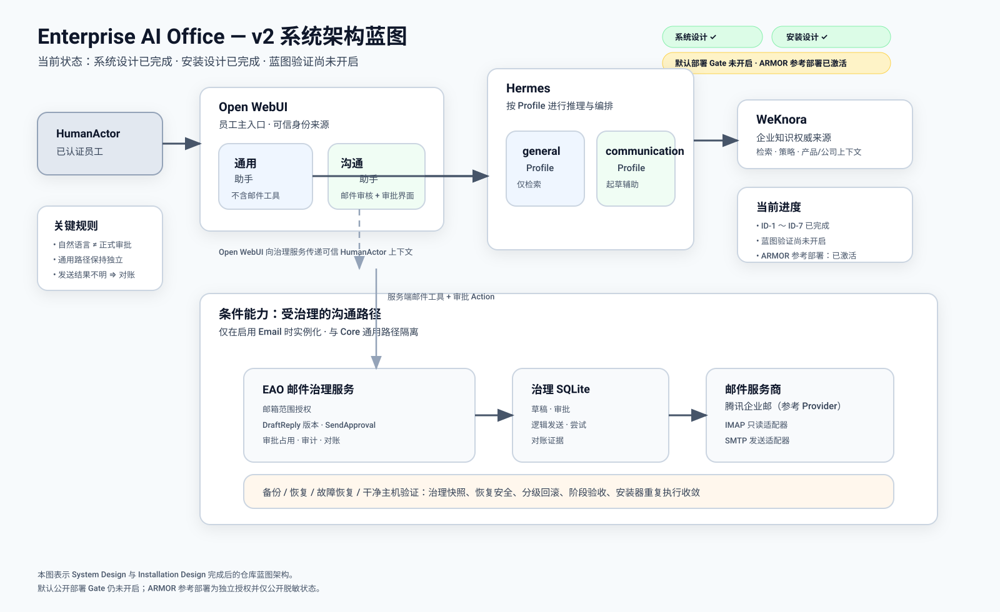

# Enterprise AI Office

> Enterprise AI Office 是一个面向企业内部 AI 办公场景的 **系统蓝图 + 安装蓝图** 项目。它基于 **WeKnora + Hermes Agent + Open WebUI** 构建，并通过能力注册表按需扩展专业 AI 角色、Coding Agent、自动化、企业消息、身份认证，以及受治理的外部业务系统操作。

**[English README](./README.md)**

## 项目进度一眼看懂

| 里程碑 / 能力 | 状态 |
| --- | --- |
| v1 核心员工使用路径 | ✅ 已有验证过的参考实现 |
| v2 System Design | ✅ 已完成 |
| v2 Installation Design | ✅ 已完成 |
| ID-1 Installation Architecture | ✅ 已完成 |
| ID-2 Config / Protected Inputs | ✅ 已完成 |
| ID-3 Stage / Capability Closure | ✅ 已完成 |
| ID-4 Identity / Authorization | ✅ 已完成 |
| ID-5 Governance Runtime | ✅ 已完成 |
| ID-6 Governed Send / Reconciliation | ✅ 已完成 |
| ID-7 Recovery / Clean-host Acceptance | ✅ 已完成 |
| Installation Design Final Review | ✅ PASS |
| Blueprint Validation | ⏳ 尚未开启 |
| Release Ready | ⏳ 尚未开启 |
| 真实企业部署任务 | ⛔ 未激活 |

> **重要说明：** 本 README 中的“已经实现”，是指仓库已经具备相应的系统设计、安装合同、参考适配器/脚本、Schema 或已验证的核心资产；并不代表 v2 邮件能力已经连接真实企业邮箱并投入生产。

机器可读权威状态：[`state/PROJECT-PHASE.yaml`](state/PROJECT-PHASE.yaml)。

## 系统架构图



整个架构刻意让已经验证过的 v1 General 路径与新增的 v2 Communication 路径相互隔离：

```text
Employee
  ↓
Open WebUI
  ├─ General Assistant
  │    ↓
  │  Hermes `general`
  │    ↓
  │  WeKnora
  │
  └─ Communication Assistant
       ├─ Hermes `communication` Profile：负责推理
       └─ Open WebUI 服务端受治理 Email Tool / Approval Action
            ↓
          eao-email-governance
            ├─ Governance SQLite
            └─ Email Provider
```

v2 Email 即使故障，也不能破坏：

```text
Open WebUI → General Assistant → Hermes general → WeKnora
```

## 当前已经实现了哪些功能

### 1）企业 AI 办公的核心员工路径

第一套已经验证过的核心栈包括：

- **Open WebUI**：员工 Web 入口；
- **Hermes Agent**：主要 Agent Runtime；
- **WeKnora**：企业知识权威来源；
- 基于企业知识的 grounded answer + source；
- Open WebUI 用户、Group、Assistant 访问控制；
- Hermes Profile API 隔离；
- 员工 Profile 最小工具权限；
- 会话历史与受控文件上传；
- 备份与隔离恢复参考流程。

核心员工工作流：

```text
Employee
→ Open WebUI
→ General Assistant
→ Hermes `general` Profile
→ WeKnora
→ 企业知识回答 + 来源
```

### 2）可以交给 AI Agent 阅读和执行的安装蓝图

仓库已经具备：

- [`AGENTS.md`](AGENTS.md)：AI Agent 仓库操作合同；
- [`DEPLOY.md`](DEPLOY.md)：安装/部署 Golden Path；
- [`config/capabilities.yaml`](config/capabilities.yaml)：机器可读能力注册表；
- Public Company Config + Private Overlay 模板；
- Protected Input / Secret Reference 合同；
- Blueprint 生命周期与真实部署双重 Gate；
- Core / Configured / Production Ready 三层部署就绪度；
- 全局与 Provider-specific Acceptance；
- Backup / Restore / Health Check / Recovery / State Recording 工具与说明。

### 3）v2：受治理的 Communication & Email 闭环

v2 已经把完整邮件工作流设计并落实为可安装参考资产：

```text
搜索邮件
→ 读取邮件
→ 生成 DraftReply
→ 人工查看最终内容
→ 确定性 SendApproval
→ 受治理发送
→ Provider Result
→ 结果不确定时 Reconciliation
→ 可选内部 Follow-up
```

当前仓库已经实现/定义：

- `Mailbox / EmailMessage / DraftReply / SendApproval` 基本对象模型；
- **HumanActor** 可信身份边界；
- Mailbox-scoped `email.read / email.draft / email.approve / email.send`；
- Open WebUI 服务端可信身份透传；
- 确定性审批 Action；
- 不可变 Draft revision + content hash；
- 一份 Approval 只能 claim 一个 logical send；
- Append-oriented Governance Audit；
- Protected Reconciliation Control Path；
- `SENT / CONFIRMED_NOT_SENT / OUTCOME_UNKNOWN` 三类发送结果语义。

### 4）最小化 EAO Email Governance Runtime

v2 没有引入大型新平台，而是只新增一个薄的 EAO Runtime：

```text
eao-email-governance
```

Reference persistence：

```text
SQLite
<runtime_root>/runtime/email-governance/state.sqlite3
```

仓库中已经有参考实现资产用于：

- Immutable DraftReply revisions；
- Review bindings；
- SendApproval evidence；
- ApprovalClaim；
- LogicalSend；
- SendAttempt；
- Provider outcome；
- Reconciliation evidence；
- Governance audit；
- Schema migration；
- Backup / Restore / Recovery。

### 5）腾讯企业邮 Reference Provider

仓库已经包含：

- IMAP 只读 Adapter；
- Non-mutating read safety tests；
- Narrow SMTP send adapter；
- Fake SMTP 离线测试；
- Provider env template；
- Provider-specific acceptance；
- Ambiguous send / duplicate send 安全合同。

Baseline 不暴露 generic SMTP/send-anything 能力。

### 6）恢复、回滚与 Clean-host 合同

ID-7 已经补齐：

- Governance SQLite 一致性备份；
- 隔离恢复；
- Schema Version Fail-closed；
- 未决 SendAttempt 恢复后继续进入 Reconciliation，而不是自动重试；
- v2 Email 开启时接入全栈备份；
- v2 未开启时不影响 v1 backup；
- 多级 capability rollback；
- Clean-host 安装验证顺序；
- Installer 第二次运行收敛要求；
- Failure injection 预期；
- v2 失败/回滚后重新证明 v1 正常。

## 为降低复杂度而主动精简 / 延后的能力

这一节专门保存 **历史架构决策**。

下面这些能力并不是“从来没考虑过”，而是为了让 Enterprise AI Office 保持简单、可维护、低风险，曾经被明确 **砍掉、缩小范围或延后**。未来只有在真实业务需求证明新增复杂度值得时，才允许重新引入。

详细的 v2 Scope Contract 仍以 [`docs/V2-SCOPE.md`](docs/V2-SCOPE.md) 为准。

| 能力 / 想法 | 当前决定 | 当时为什么精简或延后 | 只有在什么情况下才重新考虑 |
| --- | --- | --- | --- |
| CRM | 延后 / 不进入 baseline | 当前受治理沟通闭环不需要 Customer/Lead/Opportunity、CRM 主数据和同步机制 | 真实 Sales / Inquiry 工作流明确需要 CRM 对象与动作 |
| ERP | 延后 / 不进入 baseline | 会新增巨大主数据、权限与集成边界，但与第一条沟通闭环无直接必要关系 | 某个真实业务流程无法在不访问 ERP 的情况下完成 |
| PIM | 延后 / 不进入 baseline | 当前产品/公司知识由 WeKnora 承担；提前接 PIM 会增加第二套权威数据系统 | 产品主数据同步成为被验证的真实需求 |
| Calendar | 延后 | 简单 Follow-up 可以先用 Hermes Cron，不需要为了提醒功能引入 Calendar integration | Meeting / Scheduling 成为核心真实工作流 |
| 员工长期记忆 | 关闭 / 延后 | 需要先证明用户隔离与隐私边界，不能为了便利提前扩大风险 | 隔离被验证，且真实员工连续性价值足够高 |
| SSO 扩展 | 延后，除非生产访问独立要求 | Open WebUI 已经承担 reference identity surface；提前扩展身份系统会增加复杂度 | 真实生产访问政策明确要求企业 SSO |
| `armor-memory` 同步 | 延后 | 会提前引入第二套 Memory/Continuity 同步问题 | 出现明确的跨系统记忆需求 |
| n8n / 新 Workflow Engine | baseline 拒绝 | Hermes Cron / Kanban 已经能覆盖当前定时与持久多步任务 | 出现已验证、Hermes 无法安全表达的真实工作流 |
| 第二个 Scheduler | 拒绝 | Hermes Cron 已经是调度权威 | Cron 被真实需求证明无法满足 |
| 额外 Vector DB / 新 RAG Layer | baseline 拒绝 | WeKnora 已经是企业知识权威，再加一套会造成状态与维护重复 | 测量证明 WeKnora / upstream 无法解决真实检索瓶颈 |
| Prometheus / Grafana 大型 Observability Stack | 延后 | 当前规模用 health check + operations procedure 已足够 | 实际运行规模、故障频率或 SLA 证明需要专门观测平台 |
| Local LLM 基础设施 | 延后 | 本地模型基础设施不是证明 Enterprise AI Office 架构所必需 | 隐私、成本或离线要求成为真实部署需求 |
| 自研 Agent Framework | 拒绝 | Hermes 已经是 Agent Runtime / Orchestration，再造一套只会重复核心平台 | Hermes 无法满足某项已证明的关键能力 |
| Graph DB / Generic Ontology Runtime | baseline 拒绝 | Ontology 当前只需要作为 Governance / Design Contract；没必要提前再建数据库与推理平台 | 真实跨系统流程要求 graph-native 查询或执行期约束 |
| 独立 Employee Portal | 拒绝 | Open WebUI 已经提供员工入口 | 某个必要员工流程无法安全地通过 Open WebUI 完成 |
| 新 IAM / 第二套员工目录 | 拒绝 | HumanActor 继续来自 Open WebUI / 企业 Identity Layer，避免重复身份状态 | 真实身份要求无法通过现有 upstream identity 层满足 |
| 多个 Messaging 平台 | 缩减为最多一个可选 Surface | 每增加一个渠道都会成倍增加身份、路由、维护和验收复杂度 | 真实员工采用证据证明第二个渠道值得维护 |
| 多个新的外部业务系统 | v2 缩减为只做 Email | 一个外部系统已经足够验证“AI → 审批 → 外部动作”的治理模式 | 后续 milestone 明确选定第二个具体业务系统 |
| Autonomous Customer-facing Send | baseline 拒绝 | 对客发送属于重要外部 Side Effect，必须经过确定性人工 Approval | 未来有明确政策/风险决策允许不同治理模型 |
| Generic SMTP / 任意 IMAP Write Tool | 拒绝 | 会绕开 Named Action、Mailbox Scope、Approval 和 Audit 边界 | baseline 不应存在例外；任何例外必须重新做 Security Review |
| Mailbox Mirror / Shadow Customer DB | 拒绝 | Email Provider 应保持 Mailbox/Message 权威来源，复制会增加同步和隐私成本 | Provider 的真实限制证明有限本地状态不可避免 |
| Governance 使用 PostgreSQL / Redis / Event Bus | baseline 拒绝 | 单机薄服务 + SQLite 已足够，恢复和维护都更简单 | 真实并发/规模数据证明 SQLite 已不够用 |
| First-class `EmailThread` | 不增加 | Thread Context 可以从 Provider Header/Identifier 重建 | 持久 Thread Semantics 成为 Policy/Workflow 所必需 |
| First-class `FollowUp` / Mini CRM Object | 不增加 | 简单 Follow-up 用 Hermes Cron；持久多步任务需要时用 Kanban | 出现 Cron/Kanban 无法表达的真实业务状态 |
| Email Attachment | 延后 | 会增加内容安全、恶意文件、隐私、存储、Hash/Approval 和 Provider 处理复杂度 | 出现明确且批准的 Governed Attachment 用例 |
| Email Bcc | 延后 | 第一条受治理发送闭环不需要，加入后会扩大 Material Approval State | 真实批准的业务流程明确需要 Bcc |

核心规则：

> **不要因为某项功能“技术上可以做”就把它重新加回来。只有当真实业务价值明显高于新增的安全、维护与运维复杂度时，才重新引入。**

## v2 Installation Design 完成情况

| ID | 工作包 | 状态 |
| --- | --- | --- |
| ID-1 | Installation Architecture + v1 Preservation | ✅ Complete |
| ID-2 | Company Config + Protected Inputs | ✅ Complete |
| ID-3 | Stage Sequencing + Capability Closure | ✅ Complete |
| ID-4 | Trusted Identity + Mailbox Authorization | ✅ Complete |
| ID-5 | Draft / Approval Governance Runtime | ✅ Complete |
| ID-6 | Governed Send + Reconciliation | ✅ Complete |
| ID-7 | Rollback / Recovery / Clean-host Acceptance | ✅ Complete |

最终评审：[`docs/V2-INSTALLATION-DESIGN-REVIEW.md`](docs/V2-INSTALLATION-DESIGN-REVIEW.md)。

当前准确状态：

```text
current_phase: installation_design
installation_design.status: complete
installation_design.transition_ready: true
blueprint_validation.status: not_opened
real_deployment_task.active: false
```

## 接下来要实现什么

### 下一阶段：Blueprint Validation

目标是验证：

> 一个全新的、有能力的 AI Engineering Agent，能否在不依赖当前聊天上下文的情况下，只阅读这个仓库，就在一个明确批准的干净验证目标上复现设计好的系统。

需要验证：

- Clean-host preflight；
- v1 安装与 preservation；
- v2 capability 安装顺序；
- Private config / Secret input；
- HumanActor identity propagation；
- Mailbox authorization；
- Governance Runtime 初始化与 migration；
- Provider Adapter；
- Stage 0–4 acceptance；
- Backup / Restore；
- Restart / Failure Recovery；
- Installer 第二次执行是否收敛；
- v2 rollback 后 v1 是否仍正常；
- 新 Agent 是否能从 repository evidence 正确继续工作。

### 再下一阶段：Release Ready

Blueprint Validation 之后：

- 汇总验证证据；
- 修复真正的 reproducibility blocker；
- 只针对验证暴露的问题 harden；
- 达到条件后声明 `RELEASE READY`。

### Baseline 之外的未来能力

只有在真实需求证明有价值时再扩展：

- Stage 5：Hermes Cron simple follow-up；
- Stage 6：企业 Messaging Surface；
- 更多 Email Provider；
- Governed attachment；
- Governed Bcc；
- 更丰富的 reconciliation/operator 工具；
- 更多企业系统集成；
- 更多 IdP-specific playbook。

## Blueprint 进度 ≠ 部署进度

### Blueprint Maturity

```text
SYSTEM DESIGN COMPLETE          ✅
INSTALLATION DESIGN COMPLETE    ✅
BLUEPRINT VALIDATED             ⏳
RELEASE READY                   ⏳
```

### Deployment-target readiness

```text
CORE READY
= 核心员工工作流可用

CONFIGURED READY
= Core Ready
  + 该企业配置中启用的全部能力都已安装并验收

PRODUCTION READY
= Configured Ready
  + 生产级恢复 / 安全 / 访问 / 运维控制已验收
```

## Source of Truth

| 信息 | 权威来源 |
| --- | --- |
| Blueprint lifecycle / real deployment gate | `state/PROJECT-PHASE.yaml` |
| System / Installation Blueprint | 仓库中的 normative contracts |
| 企业知识 | WeKnora |
| AI 角色 / 行为 / Skills / Tools | Hermes Profiles |
| 员工 Web 身份与访问 | Open WebUI / 企业 Identity Layer |
| Mailbox / Email Provider Delivery Fact | Email Provider |
| Draft / Approval / Governed Send Evidence | EAO Governance Layer |
| Durable Agent Tasks | Hermes Kanban（启用时） |
| Scheduled Work | Hermes Cron（启用时） |
| Desired Deployment | 企业私有配置 |
| Actual Deployment | Runtime + Deployment State |

## 关键设计原则

### HumanActor ≠ Hermes Profile ≠ Provider Credential

Hermes Profile 是 AI 工作角色/能力边界，不是员工账号。

### Knowledge ≠ Memory

```text
WeKnora = 权威共享企业知识
Hermes Memory = 可选连续性状态，需要单独满足隔离条件
```

### 自然语言 ≠ 正式 Approval

“可以，发吧”可以表达 intent，但不能由 LLM 自己推断成正式 SendApproval。

### 不确定的外部 Side Effect 必须 Fail Safe

```text
SENT
→ 绝不重试

CONFIRMED_NOT_SENT
→ 满足条件时可在同一个 logical_send 中受控重试

OUTCOME_UNKNOWN
→ RECONCILIATION_REQUIRED
→ 禁止 blind retry
```

### Upstream First

```text
成熟 upstream capability
→ 官方 integration
→ configuration
→ thin adapter / playbook
→ 只有确实必要时才自建组件
```

## 第一套已验证 Core Stack

```text
Host: Apple Silicon macOS
Container runtime: OrbStack / Docker
WeKnora: v0.8.0
Hermes Agent: v0.21.0, host-native
Open WebUI: v0.11.3
Employee Hermes long-term memory: disabled
```

机器可读版本基线：[`config/validated-stack.yaml`](config/validated-stack.yaml)。

Reference instance evidence：[`state/DEPLOYMENT-STATE.md`](state/DEPLOYMENT-STATE.md)。

新部署应使用 [`state/DEPLOYMENT-STATE.template.md`](state/DEPLOYMENT-STATE.template.md)。

## 交给 AI Agent 时的推荐阅读顺序

1. [`AGENTS.md`](AGENTS.md)
2. [`state/PROJECT-PHASE.yaml`](state/PROJECT-PHASE.yaml)
3. [`DEPLOY.md`](DEPLOY.md)
4. [`docs/COMPLETENESS.md`](docs/COMPLETENESS.md)
5. 企业私有配置（基于 `config/company.example.yaml`）
6. [`config/capabilities.yaml`](config/capabilities.yaml)
7. [`config/validated-stack.yaml`](config/validated-stack.yaml)
8. 相关 infrastructure playbook / adapter
9. [`docs/ACCEPTANCE-TESTS.md`](docs/ACCEPTANCE-TESTS.md)

v2 Email 继续阅读：

1. [`docs/V2-SCOPE.md`](docs/V2-SCOPE.md)
2. [`docs/V2-EMAIL-DESIGN.md`](docs/V2-EMAIL-DESIGN.md)
3. [`docs/V2-INSTALLATION-ARCHITECTURE.md`](docs/V2-INSTALLATION-ARCHITECTURE.md)
4. [`docs/V2-CONFIG-PROTECTED-INPUTS.md`](docs/V2-CONFIG-PROTECTED-INPUTS.md)
5. [`docs/V2-STAGE-CONTRACTS.md`](docs/V2-STAGE-CONTRACTS.md)
6. [`docs/V2-IDENTITY-AUTHORIZATION-INSTALLATION.md`](docs/V2-IDENTITY-AUTHORIZATION-INSTALLATION.md)
7. [`docs/V2-GOVERNANCE-RUNTIME.md`](docs/V2-GOVERNANCE-RUNTIME.md)
8. [`docs/V2-SEND-RECONCILIATION.md`](docs/V2-SEND-RECONCILIATION.md)
9. [`docs/V2-RECOVERY-CLEAN-HOST.md`](docs/V2-RECOVERY-CLEAN-HOST.md)
10. [`docs/V2-INSTALLATION-DESIGN-REVIEW.md`](docs/V2-INSTALLATION-DESIGN-REVIEW.md)

## Repository Self-check

```sh
sh scripts/repository-readiness-check.sh
```

v2 相关离线测试资产：

```sh
python3 infrastructure/email/governance/test_schema.py
python3 infrastructure/email/governance/test_send_reconciliation.py
python3 infrastructure/email/governance/test_recovery.py
python3 infrastructure/email/tencent-exmail/test_imap_readonly.py
python3 infrastructure/email/tencent-exmail/test_smtp_send_adapter.py
```

静态/离线 PASS 只是 Blueprint Evidence，不代表真实 Provider 或生产环境已经完成验收。

## 主要文档

| 文档 | 用途 |
| --- | --- |
| [`AGENTS.md`](AGENTS.md) | AI Agent 操作合同 |
| [`state/PROJECT-PHASE.yaml`](state/PROJECT-PHASE.yaml) | Blueprint 生命周期 + Real Deployment Gate |
| [`DEPLOY.md`](DEPLOY.md) | 安装 / 部署 Golden Path |
| [`docs/COMPLETENESS.md`](docs/COMPLETENESS.md) | Readiness 语义 |
| [`docs/V2-PHASE-STATUS.md`](docs/V2-PHASE-STATUS.md) | 当前 v2 状态 |
| [`docs/V2-SCOPE.md`](docs/V2-SCOPE.md) | v2 Scope + 明确精简项 / Non-goals |
| [`docs/V2-EMAIL-DESIGN.md`](docs/V2-EMAIL-DESIGN.md) | v2 Governed Email System Design |
| [`docs/V2-INSTALLATION-ARCHITECTURE.md`](docs/V2-INSTALLATION-ARCHITECTURE.md) | ID-1 |
| [`docs/V2-CONFIG-PROTECTED-INPUTS.md`](docs/V2-CONFIG-PROTECTED-INPUTS.md) | ID-2 |
| [`docs/V2-STAGE-CONTRACTS.md`](docs/V2-STAGE-CONTRACTS.md) | ID-3 |
| [`docs/V2-IDENTITY-AUTHORIZATION-INSTALLATION.md`](docs/V2-IDENTITY-AUTHORIZATION-INSTALLATION.md) | ID-4 |
| [`docs/V2-GOVERNANCE-RUNTIME.md`](docs/V2-GOVERNANCE-RUNTIME.md) | ID-5 |
| [`docs/V2-SEND-RECONCILIATION.md`](docs/V2-SEND-RECONCILIATION.md) | ID-6 |
| [`docs/V2-RECOVERY-CLEAN-HOST.md`](docs/V2-RECOVERY-CLEAN-HOST.md) | ID-7 |
| [`docs/V2-INSTALLATION-DESIGN-REVIEW.md`](docs/V2-INSTALLATION-DESIGN-REVIEW.md) | Installation Design Final Review |
| [`docs/ACCEPTANCE-TESTS.md`](docs/ACCEPTANCE-TESTS.md) | 全局 Acceptance |
| [`docs/acceptance/TENCENT-EXMAIL.md`](docs/acceptance/TENCENT-EXMAIL.md) | 腾讯企业邮 Acceptance |

## 这个项目不是什么

Enterprise AI Office 不准备变成：

- 新的 RAG Engine；
- 新的通用 Agent Framework；
- WeKnora / Hermes / Open WebUI Fork；
- CRM / ERP；
- 通用 Workflow Engine；
- Codex / Claude Code 替代品；
- “什么功能都装进去”的 AI 组件大礼包。

它真正的价值是：**System Design + Installation Design、能力驱动的 Desired State、治理边界、成熟 upstream 的薄适配、恢复规则、Acceptance Evidence，以及一套可以交给 AI Agent 执行的工程规范。**

## ARMOR Reference

ARMOR 是第一套 Reference Implementation，但本项目本身保持通用。

ARMOR-specific 的设计与经验放在 [`reference/armor/`](reference/armor/) 下，不得覆盖其他采用者自己的 private configuration。

## License

Apache License 2.0，见 [`LICENSE`](LICENSE)。

上游独立项目保留各自 License / Terms，见 [`THIRD_PARTY_NOTICES.md`](THIRD_PARTY_NOTICES.md)。