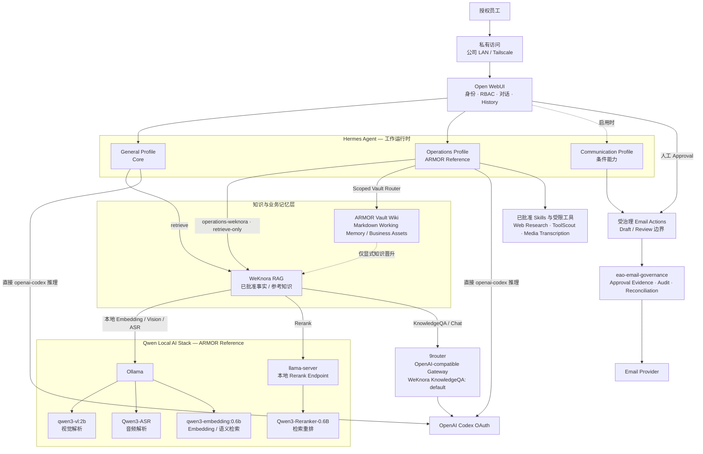

# Enterprise AI Office

> **EAO 基线：已完成 / 已部署 / 已具备交付条件 / 已投入使用。** Enterprise AI Office 是 ARMOR 基于 **WeKnora RAG + ARMOR Vault Wiki + Hermes Agent + Open WebUI** 搭建的自托管企业 AI 办公系统。参考系统已经完成在指定公司 Mac Studio 上的安装与验收，员工访问条件已经准备完成，可以直接进行部门交接。本仓库现在同时承担两个角色：一是当前已部署参考系统的维护型权威来源；二是可供其它有能力的 AI Agent 在获得明确私有部署输入后，从零复建同类 EAO 的系统蓝图与安装蓝图。

**[English README](./README.md)**

## AI Agent 从这里开始

如果你是一个没有任何历史聊天上下文的新 AI 工程 Agent，不要根据目录名或旧会话猜测系统结构。按以下顺序开始：

1. [`AGENTS.md`](AGENTS.md) —— 仓库级 Agent 操作合同。
2. [`REPRODUCE.md`](REPRODUCE.md) —— 从零复建 EAO 的完整合同。
3. [`config/eao-manifest.yaml`](config/eao-manifest.yaml) —— 机器可读的系统总清单。
4. [`VALIDATE.md`](VALIDATE.md) —— Fresh-Agent 验证合同。
5. [`DEPLOY.md`](DEPLOY.md) —— 部署 Golden Path。
6. [`state/REAL-DEPLOYMENT-STATUS.md`](state/REAL-DEPLOYMENT-STATUS.md) —— 当前 ARMOR 真实参考部署的脱敏状态。

提出任何新组件之前，必须先执行 [Capability Reuse Pass](docs/CAPABILITY-REUSE-PASS.md)。文档层级与权威顺序请查看 [文档权威地图](docs/README.md)。 维护者与 AI 工程 Agent 还应遵循 [仓库治理规范](docs/REPOSITORY-GOVERNANCE.md)。

## 项目进度一眼看懂

**当前项目状态：** EAO Core 基础建设与 ARMOR 参考部署安装均已完成。当前系统已经通过现阶段验收，具备部门交付条件，员工可以通过已批准的私有访问路径使用 EAO；部门账号与访问地址已经可以进入实际交付。后续工作以真实使用反馈驱动的维护，以及明确选择的新业务能力为主。下一项计划中的业务能力是受治理的 AI 邮件营销。

| 里程碑 / 能力 | 状态 |
| --- | --- |
| ARMOR 参考 EAO 基线 | ✅ 已部署 / 已投入使用 / CONFIGURED READY — PASS |
| v1 核心员工使用路径 | ✅ 已有验证过的参考实现 |
| v2 System Design | ✅ 已完成 |
| v2 Installation Design | ✅ 已完成 |
| ID-1 Installation Architecture | ✅ 已完成 |
| ID-2 Config / Protected Inputs | ✅ 已完成 |
| ID-3 Stage / Capability Closure | ✅ 已完成 |
| ID-4 Identity / Authorization | ✅ 已完成 |
| ID-5 Governance Runtime | ✅ 已完成 |
| ID-6 Governed Send / Reconciliation | ✅ 已完成 |
| ID-7 Recovery / Clean-host Acceptance | ✅ 已完成 |
| Installation Design Final Review | ✅ PASS |
| Enterprise Operations Capability Baseline v1.0 | ✅ 已冻结 |
| Hermes Skills Migration v1.0 | ✅ 已关闭 |
| Enterprise Web Research v1.0 | ✅ 已关闭 / 冻结 / PASS |
| Operations 员工 RBAC v1 | ✅ 已关闭 / 冻结 / PASS |
| Media Transcription 可选能力 | ✅ 已验证 / ARMOR Reference 已启用；非 Core 默认能力 |
| EAO 运行基线 | ✅ 已完成 / 已部署 / 已投入使用 |
| 双知识库架构（RAG + Wiki） | ✅ 已启用 — WeKnora RAG + ARMOR Vault Wiki / Working Memory |
| Enterprise Self-Evolution v1 | 🧭 设计基线已定义 — 从员工正常工作中内嵌学习岗位经验；运行时尚未启用，需先审计 Hermes 实际能力 |
| WeKnora Qwen Local AI Stack | ✅ 已启用 — Qwen3 Embedding + Reranker + Vision + ASR；Hermes 主推理保持独立 |
| Deployment Hardening v1 | ✅ 容器重建安全 / 服务发现 / Secret 连续性 / Volume Identity 已 PASS；当前仅远程控制，整机重启复验暂缓 |
| 部门交接准备 | ✅ 已完成 — 员工账号与私有访问资料可直接交付 |
| 公司内部员工访问 | ✅ 已通过批准的私有网络路径验证 |
| 公司外远程访问 | ✅ 已通过 Tailscale 私有访问验证；无需公开暴露服务 |
| 仓库维护模式 | ✅ 仅保留一个长期分支：`main` |
| Backup / Restore | ➖ 可选能力 / 当前未启用 |
| 下一项业务能力 | ▶ 受治理的 AI 邮件营销 |
| Blueprint Validation | ✅ 已开启；是否 PASS 仍以验证证据为准 |
| Release Ready | ✅ 已开启；开启阶段本身不等于已经声明 RELEASE READY |
| ARMOR 真实部署 | ✅ 已激活 / 已部署 / 已投入使用；运行细节保持私有，仅公开脱敏状态 |

> **实际运行状态：** ARMOR 的 EAO 基线已经完成在指定公司 Mac Studio 上的安装，并通过现阶段验收，当前已具备部门上线交接条件。员工账号和已批准的私有访问地址可以直接交付给部门同事使用。员工可以登录 Open WebUI，并通过已批准的 General / Operations AI 路径开展办公。访问路径已经分别验证：公司内部可通过批准的私有网络访问；公司外可通过 Tailscale 私有网络访问，因此授权员工无需把 EAO 暴露到公网也可以远程使用。Mac Studio 内置硬盘当前作为 EAO 的运行与主数据存储盘。Backup / Restore 是独立的可选能力，目前不启用；以后只有在业务需要和存储条件合适时再显式开启。
>
> Public Blueprint 生命周期是仓库治理状态，不等同于 ARMOR 真实部署是否存在、是否已经可用。当前基线已经达到 `CONFIGURED READY — PASS`，后续 EAO 工作应以实际使用反馈驱动的维护和边界清晰的能力扩展为主，而不是继续把 Core 平台当成未完成项目建设。
>
> **重要说明：** 本 README 中的“已经实现”，是指仓库已经具备相应的系统设计、安装合同、参考适配器/脚本、Schema 或已验证的核心资产；并不代表 v2 邮件能力已经连接真实企业邮箱并投入生产。受治理的 AI 邮件营销属于下一项独立业务能力。

机器可读权威状态：[`state/PROJECT-PHASE.yaml`](state/PROJECT-PHASE.yaml)。

## 管理员资源引入

当管理员发现有价值的**知识资料、Tool / MCP / 服务，或第三方 Skill** 时，从 [Administrator Resource Intake](docs/ADMIN-RESOURCE-INTAKE.md) 开始。

它只是现有权威流程的统一入口，不是新的管理员运行时：

- 持久知识 → [Knowledge Intake v1](docs/KNOWLEDGE-INTAKE.md) → WeKnora 原生导入与检索验收；
- Tool / MCP / 服务 / 组件 → [Capability Reuse Pass](docs/CAPABILITY-REUSE-PASS.md) → 优先复用，仅在真实能力缺口存在时走受治理变更；
- 第三方 Skill → [Capability Reuse Pass](docs/CAPABILITY-REUSE-PASS.md) → [Third-Party Skill Admission Standard](docs/SKILL-ADMISSION.md) → DIRECT / ADAPT / DELEGATE / REJECT。

统一原则是：**先审查，再产生生产变更**。安装完成并不等于已经暴露给 Profile，也不等于已经获得授权。

## Enterprise Self-Evolution 设计基线

EAO 现在已经定义规范性的 [Enterprise Self-Evolution v1](docs/SELF-EVOLUTION.md) 设计，用于把员工在正常工作过程中自然产生的经验，逐步转化为可复用的组织智能。

最核心的产品约束是：**不能最后变成人类服务 AI 系统。** 普通员工不应该为了让 EAO 变聪明而额外填写知识表单、手工分类经验、维护 AI 知识库，或者处理日常审核队列。优先采用工作内嵌式学习：

```text
员工正常工作
→ Hermes 识别可复用的纠正 / 经验 / 例外
→ 形成带来源与上下文的岗位经验
→ 后续相关工作中受限复用
→ 通过真实工作继续纠正 / 强化
→ 持续完善
```

该设计复用现有 Open WebUI、Hermes、ARMOR Vault、WeKnora、Skills、Profile 与仓库治理体系，**不新增数据库、向量库、工作流引擎，也不要求企业新增一个“全岗位知识审核员”角色**。

当前边界：Self-Evolution 架构已经定义，但运行时**尚未启用**。员工 Hermes 长期 Memory 继续保持 OFF；不授权 Hermes 自主修改生产 Skills；普通 Vault 内容不自动进入 WeKnora。下一步必须先对实际部署的 Hermes Runtime 做 Phase 0 能力审计，再决定哪些原生 Self-Improvement 能力可以安全复用。

## 仓库维护模式

EAO 采用**一人维护、单主线**模式。

```text
main
  ↓
短期 task branch
  ↓
Pull Request
  ↓
Repository Readiness PASS
  ↓
merge
  ↓
自动删除 head branch
```

规则：

- `main` 是唯一长期分支；
- 不长期保留 `develop`、`release/*`、`docs/*`、`fix/*`、`codex/*`、`ci/*`、`test/*` 等并行分支；
- GitHub 的 **Automatically delete head branches** 已启用；
- 开发历史由 Git commit 与 merged PR 保存，不再依赖长期历史分支；
- 有实质影响的修改使用短期分支，合并后立即删除；
- 仓库重点保持“当前可部署、可维护的 EAO 状态”，避免积累废弃的并行实现。

完整规则见 [仓库治理规范](docs/REPOSITORY-GOVERNANCE.md)。

## 系统架构总览

当前 Enterprise AI Office 的整体架构围绕四条稳定边界展开：私有员工访问入口、基于 Hermes Profile 的工作执行层、双知识层，以及按业务能力独立启用的受治理集成。ARMOR 的专用能力建立在可复用 Core 之上，而不是反过来重定义 Core。

Communication/Email 是**条件能力**，不属于强制 Core；只有当前公司配置显式启用时才会实例化。



上图表达的是**当前 EAO 的整体系统视图**，并不表示每个部署都必须启用图中的所有能力。

| 层 / 路径 | 当前状态 | 架构含义 |
| --- | --- | --- |
| **Open WebUI** | Core / 已部署 | 员工身份、RBAC、对话 UX、History 与已批准 Assistant 访问入口 |
| **Hermes General** | Core / 已验证 | 默认员工工作运行时与推理路径 |
| **Hermes Operations** | ARMOR Reference / 已部署 / 已冻结 | 共享的最小权限部门 Profile，使用已批准 Skills、受限工具、WeKnora 检索与 Scoped Vault 能力 |
| **WeKnora RAG** | Core 知识层 / 已启用 | 已批准企业事实 / 参考知识的摄取、检索、Grounding 与来源证据 |
| **ARMOR Vault Wiki** | ARMOR 知识层 / 已启用 | 长期 Markdown Working Memory、工作产物、Research、发布记录、流程标准与 Business Assets |
| **Qwen Local AI Stack** | ARMOR Reference / 已启用 | WeKnora 的 Embedding、Rerank、Vision、ASR 统一采用轻量 Qwen 模型；**不是** Hermes 主推理模型 |
| **9router** | ARMOR Reference / WeKnora KnowledgeQA 已启用 | 向 WeKnora 暴露 `default` 组合的 OpenAI-compatible Gateway；与 Hermes 直接使用 `openai-codex` 的路径彼此独立 |
| **Communication / Governed Email** | 条件能力资产 | 只有显式配置后才启用；任何对外发送仍受人工 Approval 与 Governance 边界约束 |
| **Git 仓库 + 企业受保护配置** | 控制 / Desired State 层 | 定义可复用蓝图、启用能力、部署合同以及私有 Runtime 输入 |

核心不变量：

- 可复用 Core 始终是 `Open WebUI → Hermes general → WeKnora`；
- Open WebUI 上游自带的 `Arena Model` 等工具属于模型评测能力，不是 EAO 工作角色、Hermes Profile 或智能任务路由器；普通员工生产工作仍应走显式配置的 Assistant → Hermes Profile 路径（见 [Open WebUI 部署适配说明](infrastructure/open-webui/README.md)）；
- WeKnora 与 ARMOR Vault 按对象 / 来源类型分工，是互补权威，不是两套重复知识库；
- 普通 Vault 工作产物**不会自动回灌 WeKnora**，只有经过明确 Knowledge Governance 决策后才允许晋升为可复用企业知识；
- ARMOR 当前将 WeKnora 的本地基础设施模型尽量统一到 Qwen 系列：Embedding、Rerank、Vision、ASR 是彼此独立的基础设施角色，不是通用本地推理模型；
- Ollama 承载 Embedding / Vision / ASR，本地 Qwen3 Reranker 通过轻量 `llama-server` Endpoint 提供；这不代表 Hermes 主推理迁移到了本地 LLM；
- Hermes General / Operations 继续使用批准的 `openai-codex` 直接推理路径；WeKnora 可选 KnowledgeQA / Chat 则通过 9router 的 `model=default` 独立提供；
- Operations 只获得已批准 Skills / Tools 与受限知识接口；普通员工不获得 generic shell、browser、filesystem、code execution 或 generic SMTP；
- Governed Email 等条件能力必须能够独立失败，不能破坏 Core 员工知识路径。

可复用架构合同见 [`docs/ARCHITECTURE.md`](docs/ARCHITECTURE.md)；当前 ARMOR 脱敏运行状态见 [`state/REAL-DEPLOYMENT-STATUS.md`](state/REAL-DEPLOYMENT-STATUS.md)；能力启用仍由 [`config/capabilities.yaml`](config/capabilities.yaml) 驱动。

### 双知识库架构：RAG + Wiki

ARMOR 当前参考部署采用两套职责互补、而不是互相竞争的知识存储：

```text
WeKnora RAG
= 已批准的企业事实 / 参考知识
= 检索、grounding、来源证据
= “什么是真的 / ARMOR 已知什么？”

ARMOR Vault Wiki
= 人类可读写的 Markdown 业务记忆
= 工作产物、项目记忆、Research、发布记录、
  受治理的流程标准与长期业务资产
= “我们做过什么 / 正在做什么？”
```

权威边界按**对象类型与来源类型**划分，而不是宣布某一套系统对所有知识拥有全局唯一权威。原始 Datasheet、Manual、测试记录、认证文件等仍然是精确技术事实的一级证据；WeKnora 是企业事实/参考知识的 RAG 检索层；ARMOR Vault 是长期 Wiki / Working Memory / Business Asset 层。

这里的 Wiki 指现有的 Markdown ARMOR Vault，不是额外部署一套 Wiki Server 或数据库。ARMOR 参考部署中的 canonical Vault 位于 Mac Studio 内置 SSD；授权人类通过受控 macOS SMB，在可信 LAN 或现有 Tailscale 私网中访问。Open WebUI Native Knowledge、Hermes Memory 与第二套 Vector DB 不作为竞争性的长期权威来源。

Operations 仍维持最小权限：通过 Scoped ARMOR Vault Adapter 进行受治理的 Vault 持久化，通用 filesystem 仍关闭。Vault 的受限检索/搜索属于同一适配边界的后续受控能力，不能用通用文件系统权限替代。

规范性的知识权威与内容归属规则见 [`docs/KNOWLEDGE.md`](docs/KNOWLEDGE.md)。

### WeKnora Qwen Local AI Stack

ARMOR 当前参考部署已经把 WeKnora 的本地基础设施模型尽量统一到 **Qwen 系列**。目标不是为了“全家桶”本身，而是在各角色质量够用的前提下，用更统一、轻量的模型体系降低部署、升级、排障与维护复杂度，并尽可能让企业文档、图片与音频处理留在 Mac Studio 本地。

```text
WeKnora v0.8.0
  ├─ Embedding
  │    └─ Ollama → qwen3-embedding:0.6b / 1024 dimensions
  ├─ Rerank
  │    └─ 本地 llama-server → Qwen3-Reranker-0.6B
  ├─ Vision / VLM
  │    └─ Ollama → qwen3-vl:2b
  ├─ Audio / ASR
  │    └─ Ollama → Qwen3-ASR
  └─ KnowledgeQA / Chat
       └─ 9router → model: default → OpenAI Codex OAuth
```

ARMOR 当前参考部署中的角色：

| 模型 / Gateway | 在 WeKnora 中的用途 | 当前运行路径 |
| --- | --- | --- |
| `qwen3-embedding:0.6b` | Embedding / 语义检索 | 本地 Ollama |
| `Qwen3-Reranker-0.6B` | 检索结果重排 | 本地 `llama-server` OpenAI-compatible Endpoint |
| `qwen3-vl:2b` | 视觉 / 多模态解析 | 本地 Ollama |
| `Qwen3-ASR`（当前 Ollama 中为 `samrito/qwen3-asr:Q8_0`） | 音频解析 / 语音转文字 | 本地 Ollama |
| `9router/default` | 可选 WeKnora KnowledgeQA / Chat | 宿主机 9router → OpenAI Codex OAuth |

这套 **Qwen Local AI Stack 是基础设施，不是 EAO 的主推理模型**。Hermes General / Operations 仍使用独立受治理的 `openai-codex` Provider。旧的 `bge-m3`、`qwen2.5vl:3b` 与 WeKnora 本地 Whisper 模型记录仅保留为迁移 / 历史证据，不再属于当前 ARMOR WeKnora 模型基线。

其它 EAO 部署仍应根据自身资源、隐私和质量要求选择 local / remote 模型。ARMOR 当前选择说明：在不新增另一套编排系统的前提下，统一的轻量 Qwen 模型家族可以显著降低本地 AI 基础设施复杂度；它不是要求所有部署复制完全相同的模型。

### 员工访问状态

ARMOR 当前部署的员工入口保持私有：

```text
授权员工
→ 公司内部已批准的私有网络 OR Tailscale 私有访问路径
→ Open WebUI
→ 已授权 Assistant / Profile
→ EAO 服务
```

ARMOR 参考部署已经实际验证公司内部私有网络路径与 Tailscale 远程路径。这样员工即使不在公司，也可以通过 Tailscale 访问 EAO，而无需把员工入口公开暴露到互联网。真实员工账号、访问地址/IP、Tailscale 节点身份以及其它私有网络信息不会写入公开仓库。

## 当前已经实现了哪些功能

### 1）企业 AI 办公的核心员工路径

第一套已经验证过的核心栈包括：

- **Open WebUI**：员工 Web 入口；
- **Hermes Agent**：主要 Agent Runtime；
- **WeKnora RAG**：企业事实 / 参考知识的批准检索层；
- **ARMOR Vault Wiki**：人类可读写的长期业务记忆、工作产物、证据与受治理资产层；
- 基于企业知识的 grounded answer + source；
- Open WebUI 用户、Group、Assistant 访问控制；
- Hermes Profile API 隔离；
- 员工 Profile 最小工具权限；
- 会话历史与受控文件上传；
- 可选的备份与隔离恢复参考流程；当前 ARMOR 部署未启用 Backup / Restore。

核心员工工作流：

```text
Employee
→ Open WebUI
→ General Assistant
→ Hermes `general` Profile
→ WeKnora
→ 企业知识回答 + 来源
```

### 2）可以交给 AI Agent 阅读和执行的安装蓝图

仓库已经具备：

- [`AGENTS.md`](AGENTS.md)：AI Agent 仓库操作合同；
- [`DEPLOY.md`](DEPLOY.md)：安装/部署 Golden Path；
- [`config/capabilities.yaml`](config/capabilities.yaml)：机器可读能力注册表；
- Public Company Config + Private Overlay 模板；
- Protected Input / Secret Reference 合同；
- Blueprint 生命周期与真实部署双重 Gate；
- Core / Configured / Production Ready 三层部署就绪度；
- 全局与 Provider-specific Acceptance；
- Backup / Restore / Health Check / Recovery / State Recording 工具与说明。

### 3）v2：受治理的 Communication & Email 闭环

v2 已经把完整邮件工作流设计并落实为可安装参考资产：

```text
搜索邮件
→ 读取邮件
→ 生成 DraftReply
→ 人工查看最终内容
→ 确定性 SendApproval
→ 受治理发送
→ Provider Result
→ 结果不确定时 Reconciliation
→ 可选内部 Follow-up
```

当前仓库已经实现/定义：

- `Mailbox / EmailMessage / DraftReply / SendApproval` 基本对象模型；
- **HumanActor** 可信身份边界；
- Mailbox-scoped `email.read / email.draft / email.approve / email.send`；
- Open WebUI 服务端可信身份透传；
- 确定性审批 Action；
- 不可变 Draft revision + content hash；
- 一份 Approval 只能 claim 一个 logical send；
- Append-oriented Governance Audit；
- Protected Reconciliation Control Path；
- `SENT / CONFIRMED_NOT_SENT / OUTCOME_UNKNOWN` 三类发送结果语义。

### 4）ARMOR Operations v1.0 当前状态

已部署的 ARMOR Operations Profile 是一个共享、最小权限的业务能力包。
当前 canonical 生产入口包括 Website Article、Website Product Materials、
Social Media（含视频规则）、MIC Product Optimization，以及 ARMOR Product
Visual 准备流程。Product Visual 只到有来源约束的 brief/prompt/provenance/QA
交接，不生成或发布图片。

Operations 只能通过封闭的 ARMOR Vault Router 合同保存经过审核的业务工作
产物，不能使用通用 shell、terminal、filesystem、browser、computer-use、
code execution、delegation 或自动发布路径。Hermes Memory 与员工 Profile
Memory 均关闭。WeKnora 是企业事实 / 参考知识的批准检索层；ARMOR Vault 是长期 Wiki / Working Memory / Business Asset 层。权威按对象与来源类型划分，不再把任一存储定义为所有知识的全局唯一权威。

完整能力矩阵、运行时证据、迁移账本、权限边界、E2E 结果和延后事项见：
[`docs/ENTERPRISE-OPERATIONS-V1.0-ACCEPTANCE.md`](docs/ENTERPRISE-OPERATIONS-V1.0-ACCEPTANCE.md)。

### 5）最小化 EAO Email Governance Runtime

v2 没有引入大型新平台，而是只新增一个薄的 EAO Runtime：

```text
eao-email-governance
```

Reference persistence：

```text
SQLite
<runtime_root>/runtime/email-governance/state.sqlite3
```

仓库中已经有参考实现资产用于：

- Immutable DraftReply revisions；
- Review bindings；
- SendApproval evidence；
- ApprovalClaim；
- LogicalSend；
- SendAttempt；
- Provider outcome；
- Reconciliation evidence；
- Governance audit；
- Schema migration；
- Backup / Restore / Recovery。

### 6）腾讯企业邮 Reference Provider

仓库已经包含：

- IMAP 只读 Adapter；
- Non-mutating read safety tests；
- Narrow SMTP send adapter；
- Fake SMTP 离线测试；
- Provider env template；
- Provider-specific acceptance；
- Ambiguous send / duplicate send 安全合同。

Baseline 不暴露 generic SMTP/send-anything 能力。

### 7）恢复、回滚与 Clean-host 合同

ID-7 已经补齐：

- Governance SQLite 一致性备份；
- 隔离恢复；
- Schema Version Fail-closed；
- 未决 SendAttempt 恢复后继续进入 Reconciliation，而不是自动重试；
- v2 Email 开启时接入全栈备份；
- v2 未开启时不影响 v1 backup；
- 多级 capability rollback；
- Clean-host 安装验证顺序；
- Installer 第二次运行收敛要求；
- Failure injection 预期；
- v2 失败/回滚后重新证明 v1 正常。

## 为降低复杂度而主动精简 / 延后的能力

这一节专门保存 **历史架构决策**。

下面这些能力并不是“从来没考虑过”，而是为了让 Enterprise AI Office 保持简单、可维护、低风险，曾经被明确 **砍掉、缩小范围或延后**。未来只有在真实业务需求证明新增复杂度值得时，才允许重新引入。

详细的 v2 Scope Contract 仍以 [`docs/V2-SCOPE.md`](docs/V2-SCOPE.md) 为准。

| 能力 / 想法 | 当前决定 | 当时为什么精简或延后 | 只有在什么情况下才重新考虑 |
| --- | --- | --- | --- |
| CRM | 延后 / 不进入 baseline | 当前受治理沟通闭环不需要 Customer/Lead/Opportunity、CRM 主数据和同步机制 | 真实 Sales / Inquiry 工作流明确需要 CRM 对象与动作 |
| ERP | 延后 / 不进入 baseline | 会新增巨大主数据、权限与集成边界，但与第一条沟通闭环无直接必要关系 | 某个真实业务流程无法在不访问 ERP 的情况下完成 |
| PIM | 延后 / 不进入 baseline | 当前产品/公司知识由 WeKnora 承担；提前接 PIM 会增加第二套权威数据系统 | 产品主数据同步成为被验证的真实需求 |
| Calendar | 延后 | 简单 Follow-up 可以先用 Hermes Cron，不需要为了提醒功能引入 Calendar integration | Meeting / Scheduling 成为核心真实工作流 |
| 员工长期记忆 | 关闭 / 延后 | 需要先证明用户隔离与隐私边界，不能为了便利提前扩大风险 | 隔离被验证，且真实员工连续性价值足够高 |
| SSO 扩展 | 延后，除非生产访问独立要求 | Open WebUI 已经承担 reference identity surface；提前扩展身份系统会增加复杂度 | 真实生产访问政策明确要求企业 SSO |
| n8n / 新 Workflow Engine | baseline 拒绝 | Hermes Cron / Kanban 已经能覆盖当前定时与持久多步任务 | 出现已验证、Hermes 无法安全表达的真实工作流 |
| 第二个 Scheduler | 拒绝 | Hermes Cron 已经是调度权威 | Cron 被真实需求证明无法满足 |
| 额外 Vector DB / 新 RAG Layer | baseline 拒绝 | 当前双知识库已经把 WeKnora RAG 与 Markdown ARMOR Vault Wiki 分工；再加 Vector Store 会重复 RAG 层并增加同步和维护风险 | 测量证明 WeKnora / upstream 无法解决真实检索瓶颈 |
| Prometheus / Grafana 大型 Observability Stack | 延后 | 当前规模用 health check + operations procedure 已足够 | 实际运行规模、故障频率或 SLA 证明需要专门观测平台 |
| Hermes 主推理使用通用本地 LLM | 延后 | ARMOR 已经使用 Ollama 为 WeKnora 提供任务专用的视觉、音频与向量模型；是否把 Hermes 主推理迁移到自托管 LLM 是另一项独立决策，并非 baseline 必需 | 隐私、成本、离线运行或真实负载需求证明有必要替换或补充当前推理 Provider |
| 自研 Agent Framework | 拒绝 | Hermes 已经是 Agent Runtime / Orchestration，再造一套只会重复核心平台 | Hermes 无法满足某项已证明的关键能力 |
| Graph DB / Generic Ontology Runtime | baseline 拒绝 | Ontology 当前只需要作为 Governance / Design Contract；没必要提前再建数据库与推理平台 | 真实跨系统流程要求 graph-native 查询或执行期约束 |
| 独立 Employee Portal | 拒绝 | Open WebUI 已经提供员工入口 | 某个必要员工流程无法安全地通过 Open WebUI 完成 |
| 新 IAM / 第二套员工目录 | 拒绝 | HumanActor 继续来自 Open WebUI / 企业 Identity Layer，避免重复身份状态 | 真实身份要求无法通过现有 upstream identity 层满足 |
| 多个 Messaging 平台 | 缩减为最多一个可选 Surface | 每增加一个渠道都会成倍增加身份、路由、维护和验收复杂度 | 真实员工采用证据证明第二个渠道值得维护 |
| 多个新的外部业务系统 | v2 缩减为只做 Email | 一个外部系统已经足够验证“AI → 审批 → 外部动作”的治理模式 | 后续 milestone 明确选定第二个具体业务系统 |
| Autonomous Customer-facing Send | baseline 拒绝 | 对客发送属于重要外部 Side Effect，必须经过确定性人工 Approval | 未来有明确政策/风险决策允许不同治理模型 |
| Generic SMTP / 任意 IMAP Write Tool | 拒绝 | 会绕开 Named Action、Mailbox Scope、Approval 和 Audit 边界 | baseline 不应存在例外；任何例外必须重新做 Security Review |
| Mailbox Mirror / Shadow Customer DB | 拒绝 | Email Provider 应保持 Mailbox/Message 权威来源，复制会增加同步和隐私成本 | Provider 的真实限制证明有限本地状态不可避免 |
| Governance 使用 PostgreSQL / Redis / Event Bus | baseline 拒绝 | 单机薄服务 + SQLite 已足够，恢复和维护都更简单 | 真实并发/规模数据证明 SQLite 已不够用 |
| First-class `EmailThread` | 不增加 | Thread Context 可以从 Provider Header/Identifier 重建 | 持久 Thread Semantics 成为 Policy/Workflow 所必需 |
| First-class `FollowUp` / Mini CRM Object | 不增加 | 简单 Follow-up 用 Hermes Cron；持久多步任务需要时用 Kanban | 出现 Cron/Kanban 无法表达的真实业务状态 |
| Email Attachment | 延后 | 会增加内容安全、恶意文件、隐私、存储、Hash/Approval 和 Provider 处理复杂度 | 出现明确且批准的 Governed Attachment 用例 |
| Email Bcc | 延后 | 第一条受治理发送闭环不需要，加入后会扩大 Material Approval State | 真实批准的业务流程明确需要 Bcc |

核心规则：

> **不要因为某项功能“技术上可以做”就把它重新加回来。只有当真实业务价值明显高于新增的安全、维护与运维复杂度时，才重新引入。**

## v2 Installation Design 完成情况

| ID | 工作包 | 状态 |
| --- | --- | --- |
| ID-1 | Installation Architecture + v1 Preservation | ✅ Complete |
| ID-2 | Company Config + Protected Inputs | ✅ Complete |
| ID-3 | Stage Sequencing + Capability Closure | ✅ Complete |
| ID-4 | Trusted Identity + Mailbox Authorization | ✅ Complete |
| ID-5 | Draft / Approval Governance Runtime | ✅ Complete |
| ID-6 | Governed Send + Reconciliation | ✅ Complete |
| ID-7 | Rollback / Recovery / Clean-host Acceptance | ✅ Complete |

最终评审：[`docs/V2-INSTALLATION-DESIGN-REVIEW.md`](docs/V2-INSTALLATION-DESIGN-REVIEW.md)。

当前准确状态：

```text
current_phase: release_ready
installation_design.status: complete
blueprint_validation.status: opened
release_ready.status: opened
real_deployment_task.active: false  # 仅表示 Fresh Clone / 新目标默认不自动授权真实部署
```

这里的 `active: false` 只描述仓库默认的新部署授权 Gate。ARMOR 参考部署已经单独获得授权、完成部署并正在使用；其受保护的运行细节不会公开到仓库。

## 当前已开启的生命周期工作

### Blueprint Validation — 已开启

Blueprint Validation 已经开启。目标是验证：

> 一个全新的、有能力的 AI Engineering Agent，能否在不依赖当前聊天上下文的情况下，只阅读这个仓库，就在一个明确批准的干净验证目标上复现设计好的系统。

需要验证：

- Clean-host preflight；
- v1 安装与 preservation；
- v2 capability 安装顺序；
- Private config / Secret input；
- HumanActor identity propagation；
- Mailbox authorization；
- Governance Runtime 初始化与 migration；
- Provider Adapter；
- Stage 0–4 acceptance；
- Backup / Restore；
- Restart / Failure Recovery；
- Installer 第二次执行是否收敛；
- v2 rollback 后 v1 是否仍正常；
- 新 Agent 是否能从 repository evidence 正确继续工作。

### Release Ready — 已开启

Release Ready 阶段也已经开启。阶段开启不等于已经声明 `RELEASE READY`。

当前需要：

- 汇总验证证据；
- 修复真正的 reproducibility blocker；
- 只针对验证暴露的问题 harden；
- 只有在所需证据满足后才正式声明 `RELEASE READY`。

### Baseline 之外的未来能力

只有在真实需求证明有价值时再扩展：

- Stage 5：Hermes Cron simple follow-up；
- Stage 6：企业 Messaging Surface；
- 更多 Email Provider；
- Governed attachment；
- Governed Bcc；
- 更丰富的 reconciliation/operator 工具；
- 更多企业系统集成；
- 更多 IdP-specific playbook。

## Blueprint 进度 ≠ 部署进度

### Blueprint Maturity

```text
SYSTEM DESIGN COMPLETE          ✅
INSTALLATION DESIGN COMPLETE    ✅
BLUEPRINT VALIDATION OPEN       ✅
RELEASE READY PHASE OPEN        ✅

Validation PASS 与最终 RELEASE READY 声明仍以证据为准。
```

### Deployment-target readiness

```text
CORE READY
= 核心员工工作流可用

CONFIGURED READY
= Core Ready
  + 该企业配置中启用的全部能力都已安装并验收

PRODUCTION READY
= Configured Ready
  + 生产级恢复 / 安全 / 访问 / 运维控制已验收
```

## Source of Truth

| 信息 | 权威来源 |
| --- | --- |
| Blueprint lifecycle / real deployment gate | `state/PROJECT-PHASE.yaml` |
| System / Installation Blueprint | 仓库中的 normative contracts |
| 已批准的企业事实 / 参考知识 | WeKnora RAG |
| 长期业务工作 / 项目记忆 / Research / 发布记录 / 受治理资产 | ARMOR Vault Wiki |
| AI 角色 / 行为 / Skills / Tools | Hermes Profiles |
| 员工 Web 身份与访问 | Open WebUI / 企业 Identity Layer |
| Mailbox / Email Provider Delivery Fact | Email Provider |
| Draft / Approval / Governed Send Evidence | EAO Governance Layer |
| Durable Agent Tasks | Hermes Kanban（启用时） |
| Scheduled Work | Hermes Cron（启用时） |
| Desired Deployment | 企业私有配置 |
| Actual Deployment | 实际 Runtime + 由 `state/DEPLOYMENT-STATE.template.md` 创建的受保护 operational state；公开状态/历史文件仅作为 evidence |

## 关键设计原则

### HumanActor ≠ Hermes Profile ≠ Provider Credential

Hermes Profile 是 AI 工作角色/能力边界，不是员工账号。

### 企业知识、Working Memory 与 Agent Memory 是不同层

```text
WeKnora RAG = 已批准的企业事实 / 参考知识检索
ARMOR Vault Wiki = 长期业务 Working Memory 与资产
Hermes Memory = 可选连续性状态，需要单独满足隔离条件
```

普通 Vault 工作产物不能自动回灌 WeKnora。只有经过明确 Knowledge Governance
决策、成为可复用企业知识后，才允许进入 RAG。

### 自然语言 ≠ 正式 Approval

“可以，发吧”可以表达 intent，但不能由 LLM 自己推断成正式 SendApproval。

### 不确定的外部 Side Effect 必须 Fail Safe

```text
SENT
→ 绝不重试

CONFIRMED_NOT_SENT
→ 满足条件时可在同一个 logical_send 中受控重试

OUTCOME_UNKNOWN
→ RECONCILIATION_REQUIRED
→ 禁止 blind retry
```

### Upstream First

```text
成熟 upstream capability
→ 官方 integration
→ configuration
→ thin adapter / playbook
→ 只有确实必要时才自建组件
```

## 第一套已验证 Core Stack

```text
Host: Apple Silicon macOS
Container runtime: OrbStack / Docker
WeKnora: v0.8.0
Hermes Agent: rolling-validated, host-native
  当前已接受的 ARMOR Reference: 0.21.2 / v2026.9.11
Open WebUI: v0.11.3
WeKnora 容器网络：以 Compose service name + Docker DNS 作为稳定身份，容器 IP 可随重建变化
Host-native 服务：在 macOS Reference 路径中由容器通过 `host.docker.internal` 访问
Ollama: ARMOR Reference 中用于 WeKnora 解析 / Embedding 的本地 AI 模型 Serving
Employee Hermes long-term memory: disabled
```

Hermes **不做永久版本锁定**。每次安装或升级事务开始时解析一个明确的
upstream candidate commit，并在本次事务内固定该 commit；通过验收后记录真实
运行版本/commit，并保留 rollback point。这样 EAO 可以持续复用 Hermes 的新
能力，同时不会把生产环境变成无人值守的 `latest` 自动追踪器。

机器可读策略 / Reference：[`config/validated-stack.yaml`](config/validated-stack.yaml)。

Reference instance evidence：[`state/DEPLOYMENT-STATE.md`](state/DEPLOYMENT-STATE.md)。

新部署应使用 [`state/DEPLOYMENT-STATE.template.md`](state/DEPLOYMENT-STATE.template.md)。

## 交给 AI Agent 时的推荐阅读顺序

1. [`AGENTS.md`](AGENTS.md)
2. [`state/PROJECT-PHASE.yaml`](state/PROJECT-PHASE.yaml)
3. [`DEPLOY.md`](DEPLOY.md)
4. [`docs/COMPLETENESS.md`](docs/COMPLETENESS.md)
5. 企业私有配置（基于 `config/company.example.yaml`）
6. [`config/capabilities.yaml`](config/capabilities.yaml)
7. [`config/validated-stack.yaml`](config/validated-stack.yaml)
8. 相关 infrastructure playbook / adapter
9. [`docs/ACCEPTANCE-TESTS.md`](docs/ACCEPTANCE-TESTS.md)

v2 Email 继续阅读：

1. [`docs/V2-SCOPE.md`](docs/V2-SCOPE.md)
2. [`docs/V2-EMAIL-DESIGN.md`](docs/V2-EMAIL-DESIGN.md)
3. [`docs/V2-INSTALLATION-ARCHITECTURE.md`](docs/V2-INSTALLATION-ARCHITECTURE.md)
4. [`docs/V2-CONFIG-PROTECTED-INPUTS.md`](docs/V2-CONFIG-PROTECTED-INPUTS.md)
5. [`docs/V2-STAGE-CONTRACTS.md`](docs/V2-STAGE-CONTRACTS.md)
6. [`docs/V2-IDENTITY-AUTHORIZATION-INSTALLATION.md`](docs/V2-IDENTITY-AUTHORIZATION-INSTALLATION.md)
7. [`docs/V2-GOVERNANCE-RUNTIME.md`](docs/V2-GOVERNANCE-RUNTIME.md)
8. [`docs/V2-SEND-RECONCILIATION.md`](docs/V2-SEND-RECONCILIATION.md)
9. [`docs/V2-RECOVERY-CLEAN-HOST.md`](docs/V2-RECOVERY-CLEAN-HOST.md)
10. [`docs/V2-INSTALLATION-DESIGN-REVIEW.md`](docs/V2-INSTALLATION-DESIGN-REVIEW.md)

## Repository Self-check

```sh
sh scripts/repository-readiness-check.sh
```

v2 相关离线测试资产：

```sh
python3 infrastructure/email/governance/test_schema.py
python3 infrastructure/email/governance/test_send_reconciliation.py
python3 infrastructure/email/governance/test_recovery.py
python3 infrastructure/email/tencent-exmail/test_imap_readonly.py
python3 infrastructure/email/tencent-exmail/test_smtp_send_adapter.py
```

静态/离线 PASS 只是 Blueprint Evidence，不代表真实 Provider 或生产环境已经完成验收。

## 主要文档

| 文档 | 用途 |
| --- | --- |
| [`AGENTS.md`](AGENTS.md) | AI Agent 操作合同 |
| [`state/PROJECT-PHASE.yaml`](state/PROJECT-PHASE.yaml) | Blueprint 生命周期 + Real Deployment Gate |
| [`DEPLOY.md`](DEPLOY.md) | 安装 / 部署 Golden Path |
| [`docs/COMPLETENESS.md`](docs/COMPLETENESS.md) | Readiness 语义 |
| [`docs/V2-PHASE-STATUS.md`](docs/V2-PHASE-STATUS.md) | 当前 v2 状态 |
| [`docs/V2-SCOPE.md`](docs/V2-SCOPE.md) | v2 Scope + 明确精简项 / Non-goals |
| [`docs/V2-EMAIL-DESIGN.md`](docs/V2-EMAIL-DESIGN.md) | v2 Governed Email System Design |
| [`docs/V2-INSTALLATION-ARCHITECTURE.md`](docs/V2-INSTALLATION-ARCHITECTURE.md) | ID-1 |
| [`docs/V2-CONFIG-PROTECTED-INPUTS.md`](docs/V2-CONFIG-PROTECTED-INPUTS.md) | ID-2 |
| [`docs/V2-STAGE-CONTRACTS.md`](docs/V2-STAGE-CONTRACTS.md) | ID-3 |
| [`docs/V2-IDENTITY-AUTHORIZATION-INSTALLATION.md`](docs/V2-IDENTITY-AUTHORIZATION-INSTALLATION.md) | ID-4 |
| [`docs/V2-GOVERNANCE-RUNTIME.md`](docs/V2-GOVERNANCE-RUNTIME.md) | ID-5 |
| [`docs/V2-SEND-RECONCILIATION.md`](docs/V2-SEND-RECONCILIATION.md) | ID-6 |
| [`docs/V2-RECOVERY-CLEAN-HOST.md`](docs/V2-RECOVERY-CLEAN-HOST.md) | ID-7 |
| [`docs/V2-INSTALLATION-DESIGN-REVIEW.md`](docs/V2-INSTALLATION-DESIGN-REVIEW.md) | Installation Design Final Review |
| [`docs/ACCEPTANCE-TESTS.md`](docs/ACCEPTANCE-TESTS.md) | 全局 Acceptance |
| [`docs/acceptance/TENCENT-EXMAIL.md`](docs/acceptance/TENCENT-EXMAIL.md) | 腾讯企业邮 Acceptance |

## 这个项目不是什么

Enterprise AI Office 不准备变成：

- 新的 RAG Engine；
- 新的通用 Agent Framework；
- WeKnora / Hermes / Open WebUI Fork；
- CRM / ERP；
- 通用 Workflow Engine；
- Codex / Claude Code 替代品；
- “什么功能都装进去”的 AI 组件大礼包。

它真正的价值是：**System Design + Installation Design、能力驱动的 Desired State、治理边界、成熟 upstream 的薄适配、恢复规则、Acceptance Evidence，以及一套可以交给 AI Agent 执行的工程规范。**

## ARMOR Reference

ARMOR 是第一套 Reference Implementation，但本项目本身保持通用。

ARMOR-specific 的设计与经验放在 [`reference/armor/`](reference/armor/) 下，不得覆盖其他采用者自己的 private configuration。

## License

Apache License 2.0，见 [`LICENSE`](LICENSE)。

上游独立项目保留各自 License / Terms，见 [`THIRD_PARTY_NOTICES.md`](THIRD_PARTY_NOTICES.md)。
